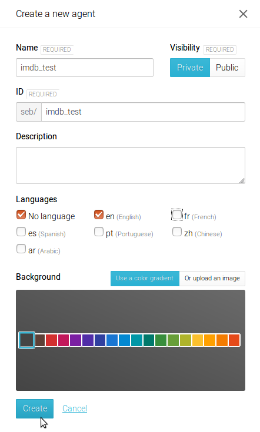
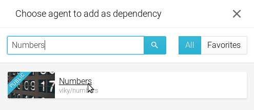
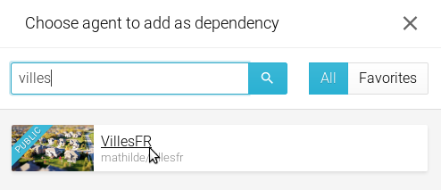
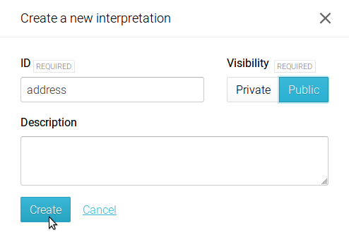
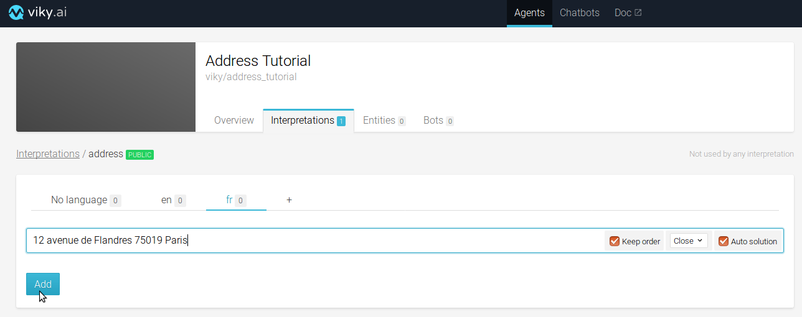

# Purpose
This tutorial will assist you in the creation of your first project into Viky.  
We will guide you to create your first agent to structure information from contents and to retrieve relevant information in these contents by interacting with your data in natural language.

The use case to start on the platform is very simple and will demonstrate the different Viky's capabilities:  
You have some contents where you want to retrieve the postal address, to create some metadata for instance to classify the information.  
Furthermore, you have customers who want to query these contents by searching with a postal address. Queries should be in natural language to facilitate the interactions.

# Best Practices to start
Definition of the perimeter and the usage is your priority before starting any new project on Viky.  
It will help you to ensure the right creation of agents.

**First step...** what is a _postal address_?
- a _postal address_ contains generally a road, its number, a postal code, a town
- it could also contain additional information about the floor, the apartment, the building
- it would be interesting to have the GPS details of the town to imagine a use on a map

_Postal addresses_ could be slightly different from one country to another. So let's started in this tutorial with french postal address!
A typical example is: 12 avenue de Flandres 75019 Paris  
Find some information about postal addresses on [Wikipedia](https://fr.wikipedia.org/wiki/Adresse_postale#France)

**Second step...** can I reuse components or should I create everything from scratch?
Think about the elementary components you will need to create agents able to identify a postal address.  
In the example "12 avenue de Flandres 75019 Paris", the decomposition into elementary elements gives :
- number,
- road type,
- road name,
- postal code (i.e. a specific pattern of numbers),
- city,
- it could optionally contain information about the apartment, building, floor.

>_**Tips and tricks**_  
Open resources exist on the web to facilitate the creation of these elements.  
> For instance, road types are available on [Wikipedia](https://fr.wikipedia.org/wiki/Odonymie_en_France#Types_de_voie) or on [GitHub Gist](https://gist.github.com/384400/bf3c83a4e7d1aa66a87e)

Viky contains already some generic agents to support you in this creation: numbers and French cities.  
We will create a module (named _**Agents**_ in Viky's world) able to identify each part of the address, and a postal address.

# Create an agent
In Viky, click on the _**Agents**_ tab, then on _**New Agent**_.  

A pop in "Create a new agent" opens.  

Fill the _**name**_ and the _**id**_ fields with "Address_Tutorial".

>_**Tips and tricks**_  
 _**id**_ must be URL-compatible.  
> préciser ce que ça veut dire URL compatible (caractères à éviter par exemple, nombre de caractères maximum, ...)

Set the visibility as _**private**_, so you will be the unique owner of the agent, to see, use or modify your agent.

Select the following options for the language: _**No language**_, _**french**_ and uncheck _**english**_.

Click on _**create**_.

The agent is now created. By default, you land on the _**Overview**_ page of the agent.  

On this section, you can manage access rights, dependencies and add a _ReadMe_ to describe your agent.  
You will add 2 dependencies as seen above : _**Numbers**_ and  _**VillesFR**_.

- Click on _**Add new dependency**_
- Search and select _**Numbers**_ public agent  
  

- Click on _**Add new dependency**_
- Search and select _**VillesFR**_ public agent

>_**Tips and tricks**_
You can add a _ReadMe_ in this _**Overview**_ section. This is particularly useful to add a description of the purpose of your agent, and some examples of what it will be able to do. For this tutorial, copy/paste the purpose of the tutorial in the _ReadMe_ section. Add the following examples of _french postal addresses_ as an illustration (it will serve also as unitary tests during the agent creation). Examples should be as representative as possible.
>- 12 avenue de Flandres 75019 Paris
>- 108 bis rue Jean Moulin 54230 Neuves-Maisons
>- 240 Impasse du Fief du Breil 44690 La Haie-Fouassière
>- 3 Passage Pommeraye 44000 Nantes
>- 1 Rue de la Miséricorde, 20200 Bastia

# First interpretation

## Create an interpretation

In the _**Interpretations**_ tab, click on _**New Interpretation**_.  

Fill the _**ID**_ with "address".  
Interpretation can be set as _**public**_ or _**private**_.

A _**public**_ interpretation will be able to return a solution as a result.  
A _**private**_ interpretation can only be used for calculation or computation.

Set your interpretation as _**Public**_ and click on _**Create**_.  

## Create your first expression

The interpretation is created, now click on it, select the _**fr**_ tab and type "12 avenue de Flandres 75019 Paris" in the text area, then click on _**add**_.  
Let the default options as they are (_keep order_, _close_, _auto solution_). We will back to them later.  

## Testing the Agent

A console panel is on the right to test in live your agent. Type "12 avenue de Flandres 75019 Paris" in the text area and click on the arrow to send the request. This console calls your agent by REST API.

You can see the returned solution in the _**Explain**_ tab (opened by default). The solution is available also in JSON format, click on the _**JSON**_ tab to check it.

The return value is an interpretation, the solution is just a part of the interpretation and the score is the match exactitude level, 0 means no match, and 1 means a complete exact match.

>_**Tips and tricks**_
The _Test Console_ has different usages. It could be a place to realize your unitary tests, each time you create a new interpretation, to validate it.  
It allows also to save your tests to create a _Test Suite_. This is a best practice to have in NLP projects, to have continuous improvements with a view of potential regressions.  
Once you run a test, you can add it to _Test Suite_ by clicking on the related button.  
It is then possible to launch a global run on all saved tests.

# Variabilize the interpretation

You may want to be able to identify any _ French postal address_ with other numbers, road types and names, and cities.

We will create sub-interpretations to variabilize each element of the initial address model we have created.

## Create a sub-interpretation

Go back in the _**Interpretations**_ tab and click on _**New Interpretation**_.

We will start with the road types.  
Enter "road_type" as an _**ID**_, let this interpretation as _**private**_ mode, then click on _**Create**_.  
Click on this new interpretation named "road_type".  
Select the _**fr**_ language tab, enter the expression "main_road_type" and then click on _**Add**_.

>_**Tips and tricks**_
We recommend best practices to name your interpretations and entities.  
Names are always in English.  
We use the singular form to name an interpretation. We use plural form to name an entities list.  
In the above example, _road types_ will have a "road_type" name for the interpretation, and we will name the list of types in the entities tab "road_type**s**".

The "shell" to call road types is ready. We will create a list of related entities.

## Create the road type entities
Click on the ***Entities*** tab and click on ***New entities list***.

Type "road_types" in the ***ID*** text field, select Private and Glued options, and click on ***Create***.  

Click on the entity list to open it and enter road types  names :

type "rue" in the ***Terms*** text area ; then click on ***Add***,  
type "avenue" in the ***Terms*** text area; then click on ***Add***,  
type "impasse" in the ***Terms*** text area; then click on ***Add***,  
type "passage" in the ***Terms*** text area; then click on ***Add***,  
etc...  

>_**Tips and tricks**_  
It is possible to import long lists of entities into Viky. Viky accepts CSV format, please refer to the documentation to learn more.

## Link entities to interpretations
Go back in _**Interpretations**_ tab, click on _**road_type**_ private interpretation, click on _**main_road_type**_ and highlight _**main_road_type**_ entry.  
A drop-down list appears, displaying the different interpretations available for variabilization.  
  
Select the ***road_types*** entities (it should be labeled like _**yourname/youragent/entities_lists/road_types**_), and click on _**Update**_.  

Go back in the ***address***  public interpretation and highlight "avenue" in your expression "12 avenue de Flandres 75019 Paris".  
In the drop-down list, select  _**road_type**_ interpretation, and click on _**Update**_.

Test the interpretation with the sentence "12 avenue de Flandres 75019 Paris", the result should be the same as your first test.

Test it now with the sentence "12 **impasse** de Flandres 75019 Paris", it should be successful as well.
