# Purpose

The purpose of this exercise will be to create an agent that understands sentences as "I want to see a movie with bruce willis", or "Show me the movie Leon", or "I want to see a movie from Clint Eastwood", in order to be able to search in the IMDB database.

The search itself won't be done here, only the sentence understanding:

The sentence "I want to see a movie with bruce willis" will return the result

    {
      "intention": "search_imdb",
      "params": [
        {
          "actor": "Bruce Willis"
        }
      ]
    }

The sentence "I want to see a movie from Clint Eastwood" will return the result

    {
      "intention": "search_imdb",
      "params": [
        {
          "director": "Clint Eastwood"
        }
      ]
    }

The sentence "I want to see a movie from Clint Eastwood with brad pitt" will return the result

    {
      "intention": "search_imdb",
      "params": [
        {
          "director": "Clint Eastwood"
        },
        {
          "actor": "Bruce Willis"
        }
      ]
    }

# Creating the Agent

In Viky, click on the ***Agents*** tab, then on ***New Agent***.

The Agent Creation popup opens.

Fills the ***name*** and the ***id*** fields with "IMDB_TEST", ***id*** must be url compatible.

Set the visibility as ***private***, so only you can see, use or change your agent.

Let the languages as ***english*** and uncheck ***french***.

Click on ***create***.

The agent is now created.

Feel free to add a readme as you want.

# First interpretation

## Creating the interpretation

In the ***Interpretations*** tab, click on ***New Interpretation***.

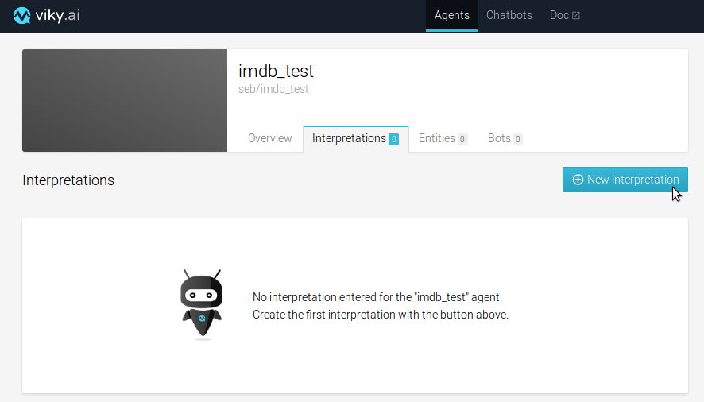

Fill the ***ID*** with "Search".

Interpretation can be set as ***public*** or ***private***.

A ***public*** interpretation will be able to return a solution as a result.

A ***private*** interpretation can only be used as for calculation or computation.

Set your interpretation as ***Public*** and click on ***Create***.

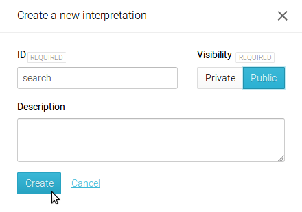

## Creating the first expression

The interpretation is created, now click on it, select the ***en*** tab and type "I want to see a movie with bruce willis" in the text area, then click on ***add***.

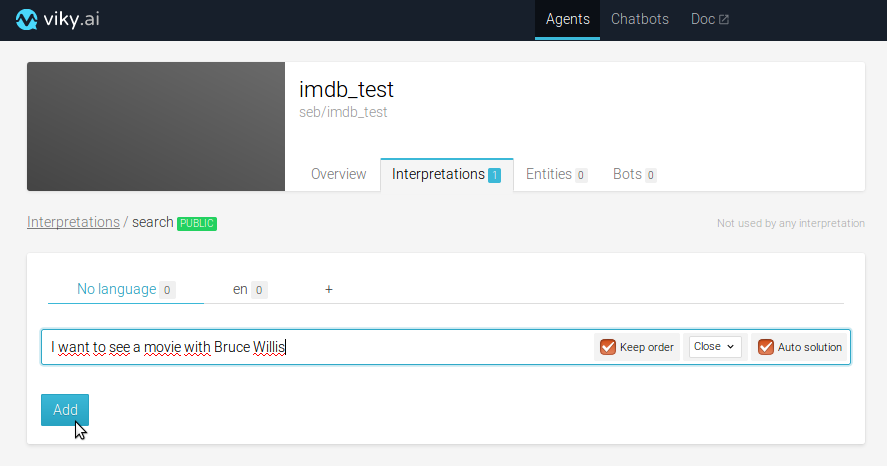

## Testing the Agent

Test it by typing "I want to see a movie with bruce willis" in the test text area and click on the arrow.

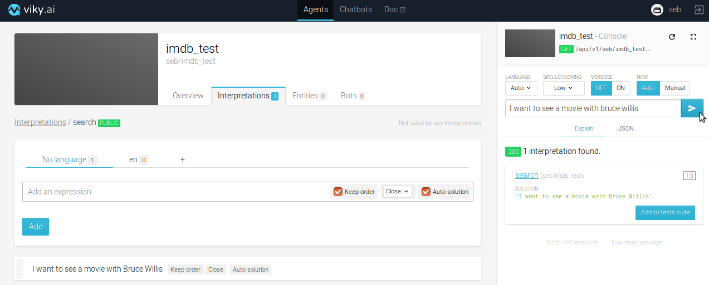

You can see the returned solution in the ***explain*** tab.

to see the full JSON return, click on the ***JSON*** tab.

The return value is an interpretation, the solution is just a part of the interpretation and the score is the match exatcitude level, 0 being a no match, and 1 being a fully exact match.

In the test panel, set the spellchecking to ***low***.

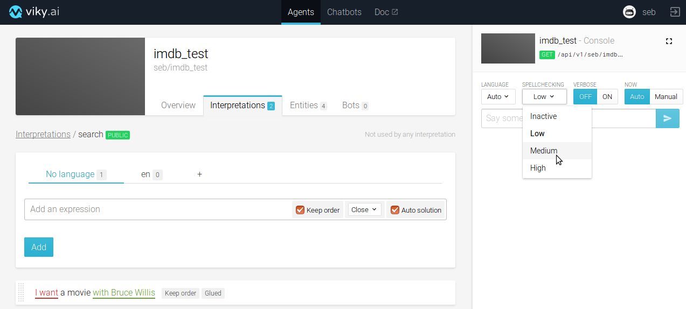

Test now the sentence "I want to see a movie with Bruce Willlis".

The actor name has been taken as "Bruce Willis", and a spellchecking has been performed.

Change the sentence to "I want to see a movie with Bruce Wallis".

No solution is given because the spellchecking has not been performed.

Set now the spellchecking level to ***medium***, the request is re-executed and the spellchecking is performed.

## Customize the solution

Click on the expression to open it, then uncheck ***auto solution***.

Then, enter

    {
      "intention": "search_imdb",
      "params": [
        {
          "actor": "Bruce Willis"
        }
      ]
    }

in the solution text area, being a javascript editor, and click on ***update***.

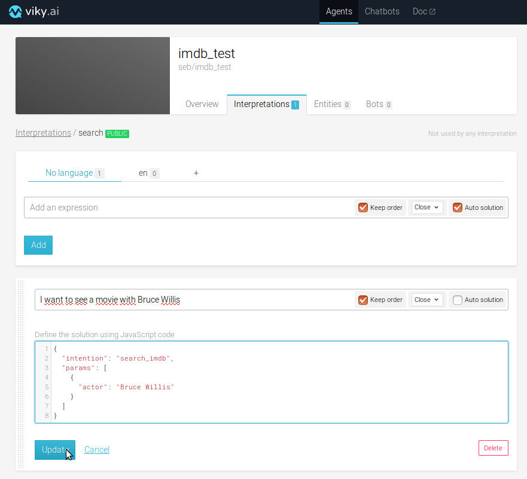

Re-test the sentence : the solution has changed and matches now the expected solution for this sentence.

# Variabilize the interpretation

You may want to be able to see movies with other actors than Bruce Willis.

For that, we will now create another interpretation understanding "with Bruce Willis" and use it in the main interpretation.

## creating the sub-interpretation

Go back in the ***Interpretations*** tab and click on ***New Interpretation***.

Put "params" as an ***ID*** and let this interpretation ***private***, then click on ***Create***.

Select the "en" language tab then add the expression "with Bruce Willis", uncheck ***auto solution***, put

    {
      "actor": "Bruce Willis"
    }

in the javascript editor then click on ***add***.

Go back to the "search" interpretation, click on the expression and highlight "with Bruce Willis".

A drop down list appears, displaying the different interpretations available for variabilization.

Select the "params" interpretation.

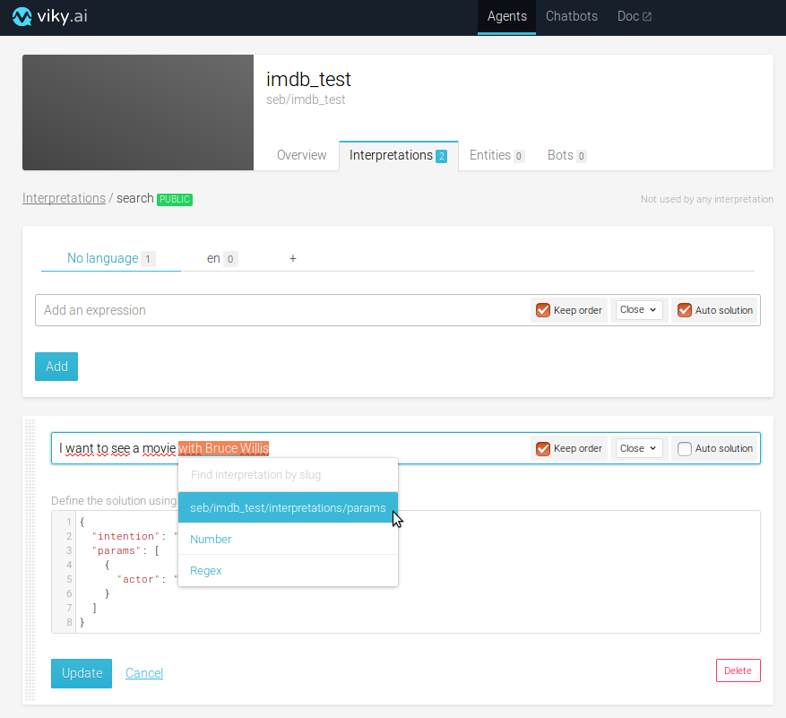

A line with the name of the interpretation is displayed. in front of the interpretation, a text field is displayed, containing the name of a variable usable in the solution.

Replace the map with tag "actor" by this variable.

The solution in the javascript editor must be

    {
      "intention": "search_imdb",
      "params": [
        params
      ]
    }

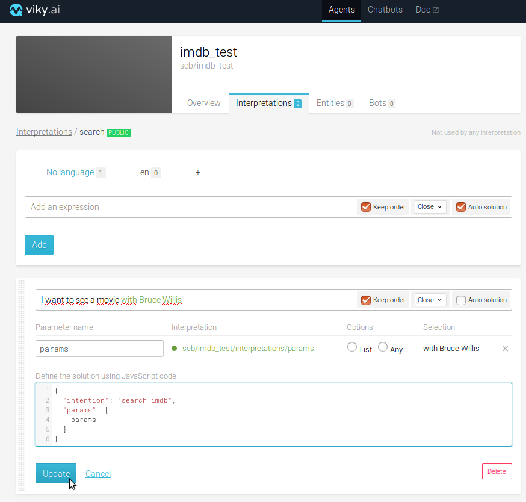

Testing the interpretation will return exactly the same thing as before.

Now, we will add some more actors.

This will be done in the entities

## Creating the Actors entities

Click on the ***Entities*** tab and click on ***New entities list***.

Type "Actors" in the ***ID*** text field, let it as Private and glued, and click on ***Create***.

Click on the entity list to open it and enter some actors names :

type "Bruce Willis" in the ***Terms*** text area; then click on ***Add***,

type "Morgan Freeman" in the ***Terms*** text area; then click on ***Add***.

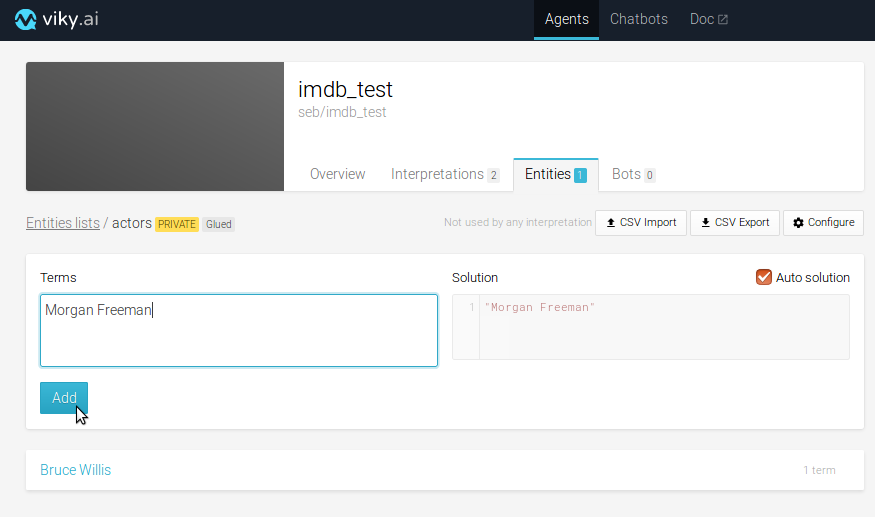

## Linking entities to interpretations

Go back in the ***params*** interpretation and highlight "Bruce Willis".

Select the ***Actors*** entities, then replace the "Bruce Willis" string with the ***actors*** value in the solution.

Solution must be

    {
      "actor": actors
    }

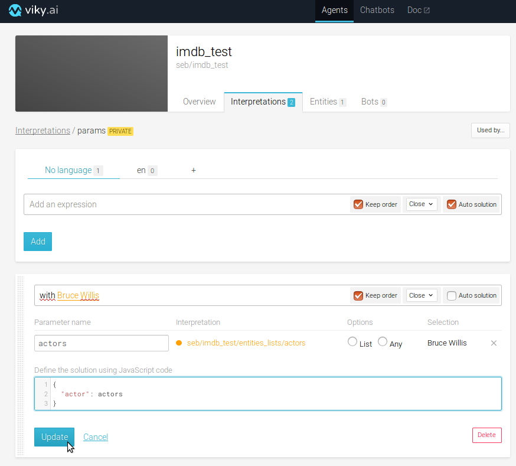

Test the interpretation with the sentence "I want to see a movie with Bruce Willis", the result is still the same.

Test it now with the sentence "I want to see a movie with morgan freeman", the result is now.

    {
      "intention": "search_imdb",
      "params": [
        {
          "actor": "Morgan Freeman"
        }
      ]
    }

## Filling entities with csv data

Filling an entity list manually can be very boring if you have a lot of data to put in it.

Another way to do it is to fill it thanks to a csv file.

The shape of this csv file has to be

    Terms,Auto solution,Solution
    <value1>,<boolean1>,<solution1>
    <value2>,<boolean2>,<solution2>
    etc...

where ***value*** is the text to be matched, ***boolean*** is the ability for the solution to be different from the text to be matched, and ***solution*** is the solution to be returned.

Create a file named actors.csv.

set its content as

    Terms,Auto solution,Solution
    Bruce Willis,true,Bruce Willis
    Morgan Freeman,true,Morgan Freeman
    Robert De Niro,true,Robert De Niro
    Brad Pitt,true,Brad Pitt

Open the ***actors*** entity list.

Click on ***CSV import***.

Drag and drop the actors.csv file in the drop area.

Click on ***Repolace current entities***.

Click on ***Import***.

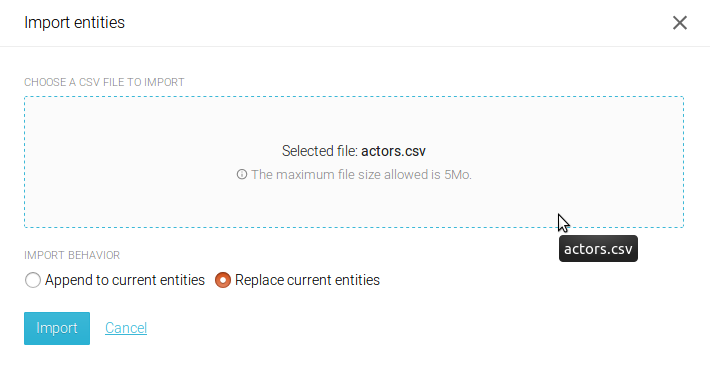

All your new actors are correctly imported in the entity list, you can now look for movies with all the actors existing in the list.

## Filling one entity with several data

If you want several expressions to be interpreted in the same way in an entity, it is very simple.

Let's do it to help us to understand "with Bruce Willis" or "With the actor Bruce Willis" in the same way.

Open the ***Entities*** tab, then create a new entities list named "with_actor".

Open it and add in the ***Terms*** text field

    with
    with actor
    with the actor

Then click on ***Add***.

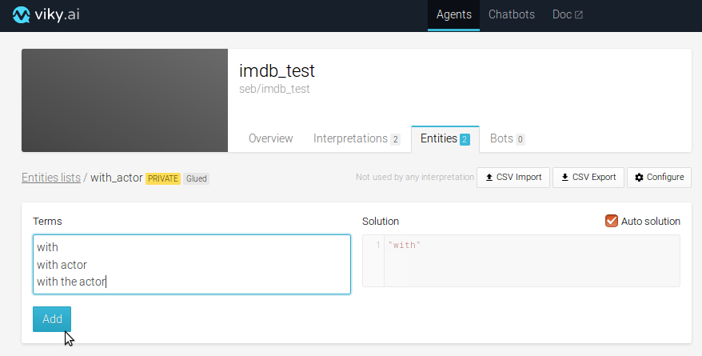

Adding multiple values in an entity using a csv file is done by separating the values with a pipe (|)
Here, the csv file would be

    Terms,Auto solution,Solution
    with|with actor|with the actor,true,with

Go back in the ***params*** interpretation, open the ***with bruce willis*** expression and highlight ***with***.

Select ***with_actor*** in the drop_down list.

Click on ***update***.

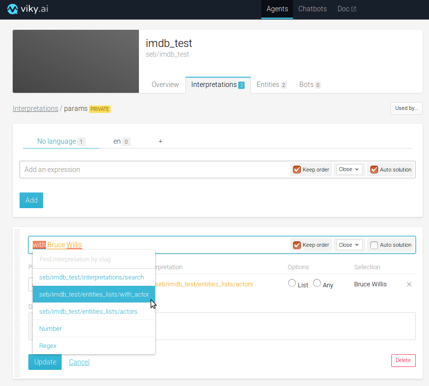

Test the sentence "I want to see a movie with the actor Bruce Willis".

You have now several ways to query a movie giving an actor known by the system.

But how about other actors?

# Recognizing unknown entities

If you test the current agent with the sentence "I want to see a movie with Benicio Del Toro", no answer will be found?

It is possible, in Viky.ai, to identify a type of word or data thanks to the sentence structure, replacing the variable's value by the detected text. This is the ***any*** option.

Open the ***params*** interpretation and open the ***with bruce willis*** expression.

Click on the ***any*** button in front of the ***actors*** entities list alias.

Click on ***Update***.

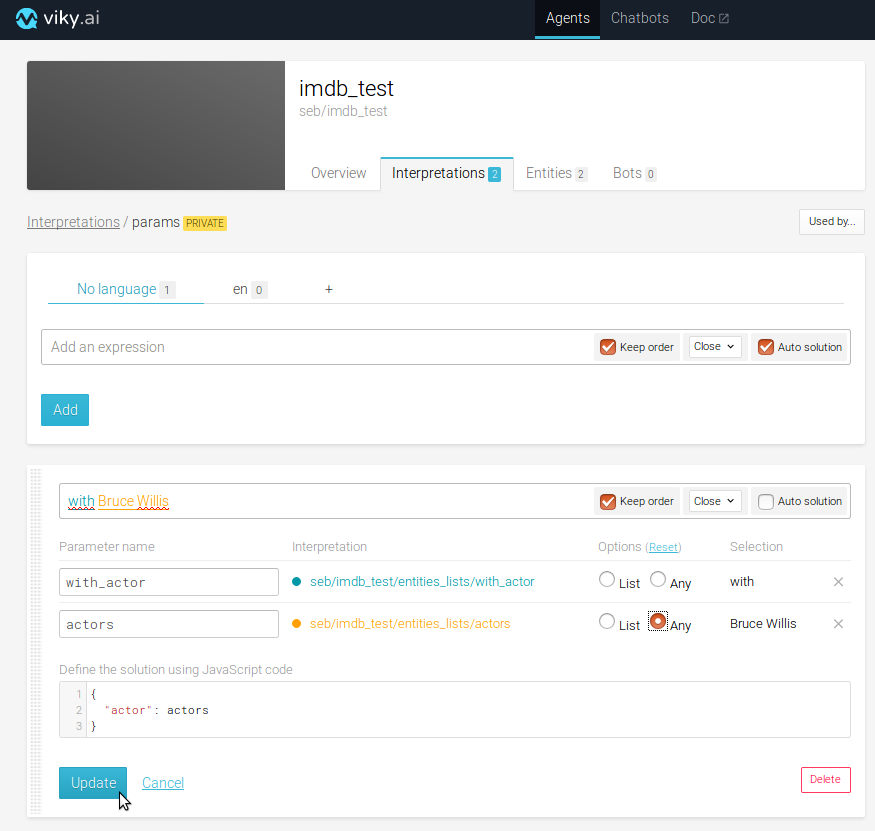

test the current agent with the sentence "I want to see a movie with Benicio Del Toro"... now it works!

# Adding several expressions to the same interpretation

We will now create another set of interpretations/entities in order to understand the sentence "I want to see a movie from Clint Eastwood", Clint Eastwood being the director.

For that, we have first to create an entity list named "from_director".

Open it and add in the ***Terms*** text field

    from
    from director
    from the director

Then, create another entity list named "directors", open it and fill it with a csv file containing

    Terms,Auto solution,Solution
    Clint Eastwood,true,Clint Eastwood
    Spike Lee,true,Spike Lee
    J.J. Abrams,true,J.J. Abrams

When it's done, open the ***params*** interpretation and add an expression ***from Clint Eastwood***.

Highlight ***from*** and make an alias to the ***from_director*** entities list.

Highlight ***Clint Eastwood*** and make an alias to the ***directors*** entities list and make it ***any***.

uncheck auto solution and set the solultion as

    {
      "director": directors
    }

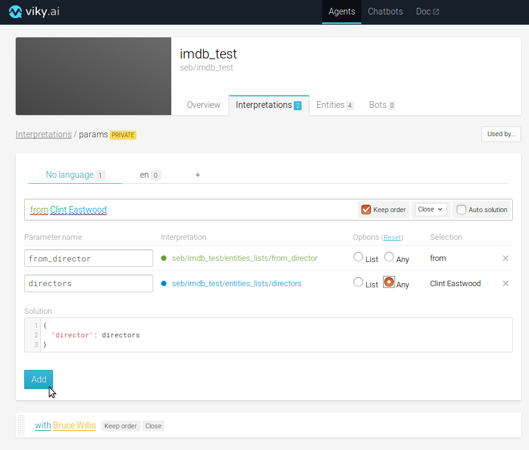

The agent si now able to understand as well the sentences "I want to see a movie with Brad Pitt" and "I want to see a movie from Clint Eastwood".

# One expression understanding several times the same intent

Now, we would like to be able to understand sentences like "I want to see a movie from Clint Eastwood with brad pitt".

Open the ***search*** interpretation, open the only expression existing, and in front of the ***params*** alias, click ***list*** then click on ***update***.

Try if with the sentence "I want to see a movie from Clint Eastwood with brad pitt".

It works but the solution has not the correct shape. You have to update the solution.

Actualy, the list will create an array with a tag named with the entity name, so we have to remove the array creation made at the beginning from the solution.

When it is done, we have a solution whose shape is :

    {
      "intention": "search_imdb",
      "params": {
          "params": [
            {
              "director": "clint eastwood"
            },
            {
              "actor": "Brad Pitt"
            }
          ]
        }
      }
    }

Which is not exactly what we want.

To avoid that, we will call the ***params*** element from the ***params*** value.

The solution to vrite in thejavascript editor will be then :

    {
      "intention": "search_imdb",
      "params": params.params
    }

# Creating external dependencies

Now we want to customize our agent a bit more, in order to understand as well "I want", "I'd like", "I would like", etc... in the same way.

By chance, there is already a public agent doing it, so we are going to use it instead of recreating what has already been done.

Go in the ***overview*** tab and click on ***Add new dependency***.

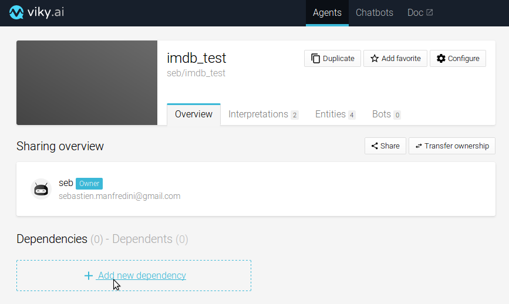

Type "want" in the search bar and click on the ***Want version 3*** agent.

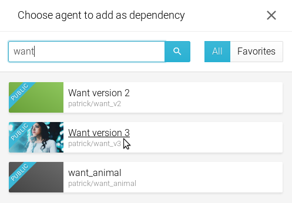

The dependency to the ***Want version 3*** agent is now created, you can navigate to this agent by clicking on it or remove this dependency if you want, but only if this agent is not used in your agent.

Go back now in your ***search*** interpretation.

Open the expression and highlight "I want".

Select the interpretation ***want*** in the drop down list.

Click on ***Update***.

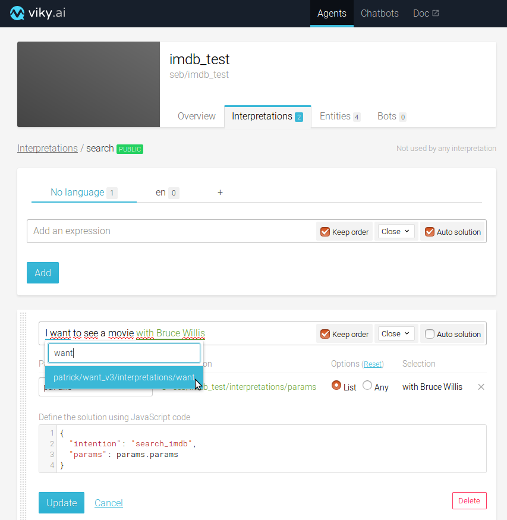

It's done, sentences such as "I'd like to see a movie from Clint Eastwood with brad pitt" will be perfectly understood.

# Allowing extra words

Now, I'd like the agent to understand in the same way "I want to see a movie with Bruce Willis" and "I want a movie with Bruce Willis".

Open the ***search*** and update the expression by removing "to see". The expression is now  "I want a movie with Bruce Willis".

Set the ***proximity*** to Glued then click on ***update***.

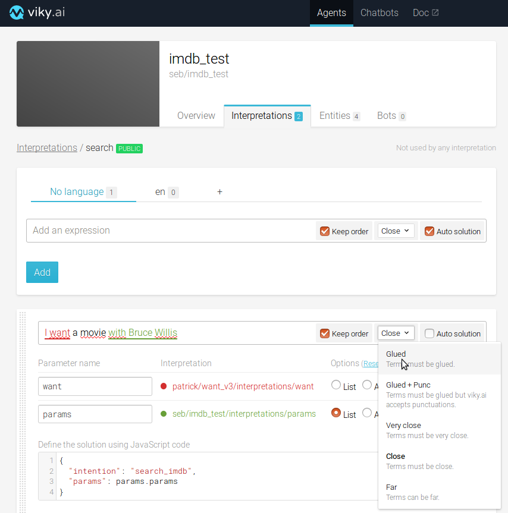

Test the sentences "I want a movie with Bruce Willis" and "I want to see a movie with Bruce Willis". The first sentence returns a result, but not the second one.

Re-open the ***search*** interpretation and set the ***proximity*** to ***close***, re-test the 2 sentences, both are returning a result now.

Several levels of proximity can be defined, as well in interpretations as in entities lists.

In the entities, the proximity is defined at the tntity list level.

In the interpretations, the proximity is defined at the expression level.
