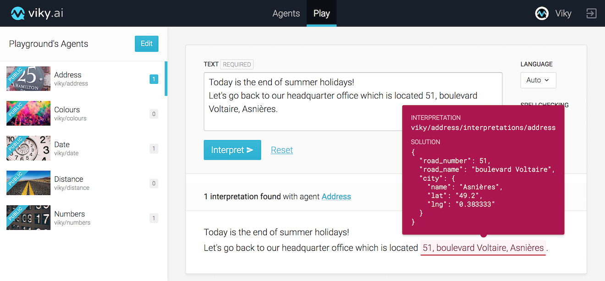

The holidays are over but we have some great news to share with you on viky.ai!

We are in the starting blocks to open this platform to the community and we are continuing the preparations to make you feel at home.

<!--keep reading-->

## Play interface

Among the amazing new features that you will soon have the opportunity to discover, we have set up a testing interface that allows you to visualize the capabilities of viky.ai in a few clicks. In the philosophy of the platform, this functionality has no programming knowledge required. All you need to do is pick your modules (we call them agents), insert your text and that's it!

I'll give you an image for illustration. The agent creators are delighted because it perfectly complements our unit test console that was already in place.

## Case sensitivity

Another new feature has also recently become available: making it easier to manage case management when creating entities.

Do you know what case sensitivity is? This is the ability to differentiate words according to upper and lower case.

The meaning can be completely different! A few simple examples (obviously I find you examples in English, but it would be easier for me to give you some in French :wink:): the Apple trademark and apple le fruit, the Windows trademark and the windows of a house&hellip;

Many proper names have their homonyms in common names and it is recommended to be able to distinguish them so that no noise is labelled.

viky.ai now offers a simple checkbox that allows you to specify whether or not the object you create is case sensitive, and also whether or not it is accent sensitive ("mais" / "maïs" in French for example).

More features are coming soon, which we look forward to introducing to you!
