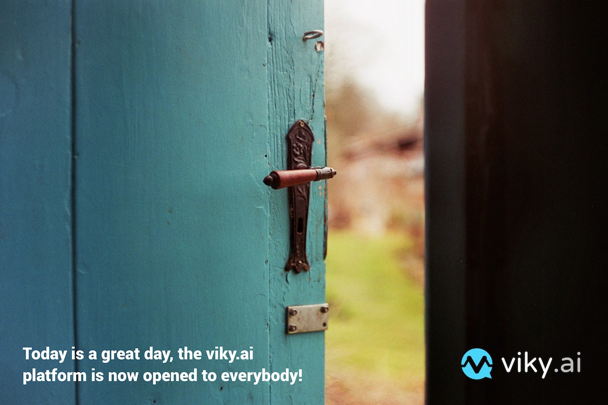

**Today is a great day**, the viky.ai platform is now opened to everybody!

This is important for us, because we have been working for more than two years on this new platform, and made our best to create what we believe is a very easy to use <acronym title="Natural Language Processing">NLP</acronym> platform. We were lucky to have some [financing](https://cordis.europa.eu/project/rcn/212164/factsheet/fr) from the European Community, but this is just a start, the future is yours!

<!--keep reading-->

What does it mean?

Well, simply that prior to this day, you had to ask us for an invitation (which we  usually gladly provided), but after today **you can freely use the platform**!

We have tested this platform with a lot of beta users, and we believe that it is now quite nice to use, so please [Sign in](/users/sign_in) with the [freemium plan](/pricing/), and **start using it, create your own agents and play with them**.

Isnt't that nice?

In any case, we provide you with a documentation. **The best way to start is to follow our [Getting Started](/doc/tutorials/getting-started-part-1/) tutorial**.

There are also a lot of public agents that you can use anyway you like. Please browse through all of it, and use viky.ai the way you want!

I hope you will enjoy the platform as much as we did the last several months.
