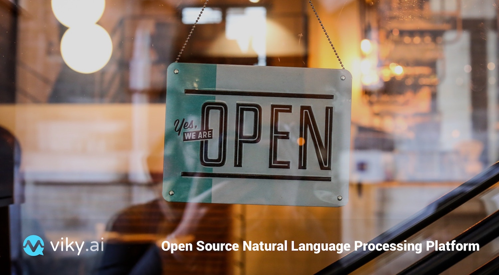

**Today is another great day**, the viky.ai platform is now available in [open source](/open-source/)!

We have been working for more than two years and have done our best to build an easy-to-use and well-documented platform.

But this was not enough. We wanted for anyone to have no stop whatsoever to use the platform. This meant "open source" for us.

<!--keep reading-->

In other words, even though we believe it is the best and easiest way for you to create your agents and play with them on the viky.ai platform, some of you will want to create your own platform for your own use. And this is very good.

Of course, we welcome your feedbacks and [contributions](https://github.com/viky-ai/viky-ai/blob/master/CONTRIBUTING.md)!

Go to the [github repository](https://github.com/viky-ai) to enjoy a whole lot of NLP code and more!

viky.ai is based upon many other open source projects, we thank all contributors of those projects for this achievement.
