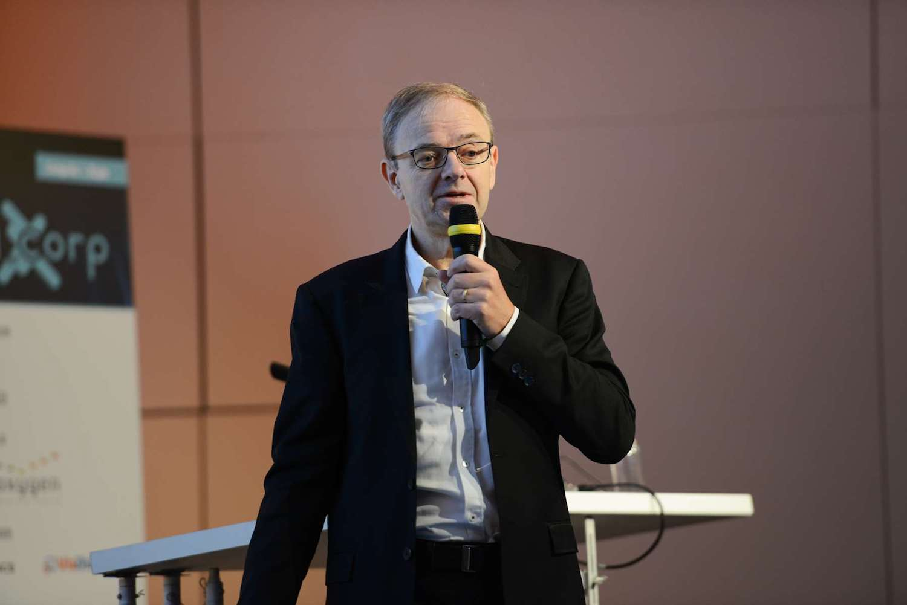

I wanted to give you a small recap of my talk at Paris Voice Tech, last week.

As Noam Chomsky said, "language is the mirror of the mind", and this is basically the idea I wanted to convey: we need to understand better the human mind if we want to better handle human languages. And the reverse could be true: if we handle better the human languages, we will be able to understand better the human mind.

<!--keep reading-->

Yes, **machine learning has done great progress**, and we now have decent speech to text and translation, **but we still have a long way to go to handle human language**.

Human language have been described by grammars for a very long time. Thus **creating a platform such as viky.ai which can help creating rules to describe piece by piece natural languages, still seems a good way to go**.

But we want to have a platform where we can do it simply, collaboratively and with an idea of reusability of the rules that have been created. After all, **many rules have been the same for centuries**!

I really hope that viky.ai will help pave the way to a better natural language understanding and thus a better understanding of the human mind.

Cheers!
