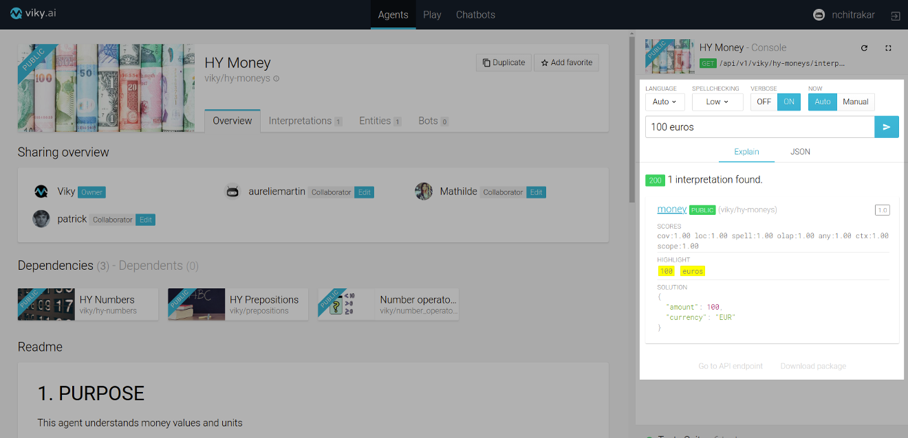
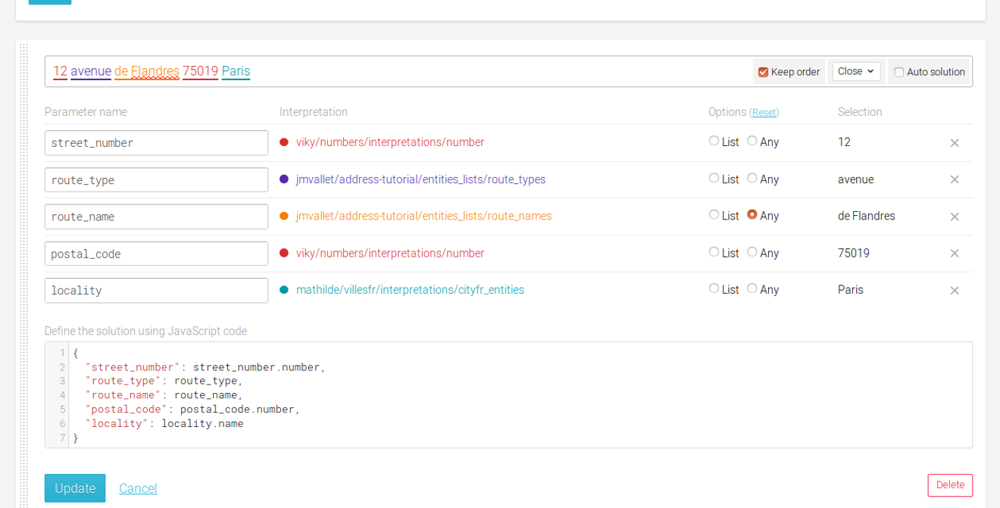
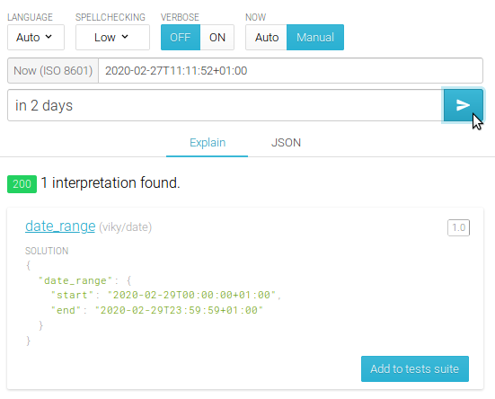

viky.ai allows you to easily try how an agent behave on specific sentences to ensure it will fit your use case.

## Understanding a sentence

When opening an agent, the console panel on the right allows you to test your agent by sending sentences to interpret. It responds with matched interpretations as well as the corresponding solution.

Here you can type a sentence and apply the same options that you can find on the public API. Those options are:
- `language`: it allows to select the language in which the sentence will be understood. By default this language is in auto detection.
- `spellchecking`: it allows to perform spellchecking with different level such as **Inactive**, **Low**, **Medium** or **High**. The highest the spellchecking will be, the more aggressively the NLP will try to match words even if they are not spelled right.
- `verbose mode`: it allows to have some debug information in order to understand how the match is performed by the NLP.
- `now`: it allows to set a fixed current date and time as desired.

As an example, open the agent dedicated to date and time and try the sentence "Book a table for the day after tomorrow".

<aside class="note">
  <h3>Note</h3>
  <p>
    This agent understand only the date part of this sentence. You could easily add it as a dependency if you want to create an agent understanding booking queries.
  </p>
</aside>

You can see in the `Explain` tab that the agent understood the expression "the day after tomorrow" in the sentence and has respond the interpretation "datetime". We can deduce that this agent is able to find time reference in a sentence and translate them in a normalized ISO 8601 format as its interpretation's solution.

In the sentence, "tomorrow" refers to the current date and time. By switching the `now` option to `manual` we can change this current time reference. If you set the `now` option to "2019-02-27T15:00:00+01:00" (_February 27, 2019_) the solution will be two days later "2019-03-01T15:00:00+01:00" (_March 1st, 2019_) but if you set it to "2020-02-27T15:00:00+01:00" (_February 27, 2020_) the solution will be also two days later "2020-02-29T15:00:00+01:00" (_February 29, 2020_) but still in February since it is a leap year.

## How a sentence is interpreted

The console panel's functionality is not just limited to that. It allows you to explore in detail how your agent interprets each word in your requested sentence. 

Let see how an agent dedicated for currencies in viky.ai interprets the sentence "100 euros". 

To explore, turn the `Verbose` mode `ON` and send the request. The `Explain` tab will now have three sections for each of the interpretations matching the sentence.

1. `Scores` section shows how the score was calculated.
2. `Highlight` section shows which words of the sentence were matched by the interpretation.
3. `Solution` section gives the corresponding solution for the sentence.



The `Highlight` section further allows you to see how the NLP matched each word with the interpretations and entities lists of the agent. Just click on one of the highlighted words. Let us click on "euros". 


You will see a list of interpretations and entities lists matched for "euros". If you watch closely, the first item in the list is the minimal interpretation matching the word. The interpretations and entities lists in the list are arranged in a tree fashion with the last one being the one that incorporates all the interpretations and entities lists above it.

You can even navigate to interpretations or entities lists from that list. Click on the first item in the list, in our case the `money_entity` entities list and the platform takes you to the exact expression within the clicked entities list that matched the word, "euros".


This gives you an exact idea how NLP breaks down your sentence to match the interpretations of the agent.

## Regression tests for your agent

Your agent can go through many changes. So you need to make sure that with every change your agent still behaves the way you want it to. Viky.ai has the notion of regression tests to help you do so. 

Let us see how we can create a regression tests suite for the `Address Tutorial` agent that we created in the [Getting started](/doc/guides/getting-started/) section. 

Every time you ask your agent to interpret a sentence, you will be given an option to add the sentence to the test suite. Type "12 avenue de Flandres 75019 Paris" in the text field of the console and send the request. You will see a `Add to tests suite` button on the bottom right corner of the `Explain` tab.


Click the button. You will now see that a `Tests Suite` has been created at the bottom of the console. You can see the summary of your test suite there.


Click on the summary. You will now see the tests suite with the test that you previously added.


Clicking on the test will show you its details: 

* `Query` i.e. the sentence for the test
* Different options chosen during the interpret request: `Spellchecking`, `Language` and `Now`
* `Slug` of the first interpretation found for the sentence and
* `Solution` for the sentence


Till now you can see that the `Tests Suite` is green which means all the tests have passed. The test details shows us that the expected and got values for the slug and the solution match. 

Let us try to edit our agent and see what happens to the tests suite.

Edit the solution for the expression in address interpretation as below:
```javascript
{
  "street_number": street_number,
  "route_type": route_type,
  "route_name": route_name,
  "postal_code": postal_code,
  "locality": locality
}
```
 

As soon as you updated your interpretation, you will see that the tests suite ran the test and updated its result. You will now see that the test has failed. You can also see what failed in the test - in our case its the solution that did not match. The test detail shows what was the expected solution and what solution was returned.


Click on the `Send` button. It prompts the console to interpret the sentence again. You will see that the console now returns the new solution that we just updated earlier.

 

The console also indicates that the test for this sentence is in failed state. Click on the `Update` button. You will see that the test passed and the expected solution for the test was updated with the new solution.

 

Hence, you saw that with every change in your agent, your tests suite will run and tell you if the tests you added passed or failed with your new changes. You can add multiple tests for different types of sentences that your agent can interpret. You can now be sure that your agent behaves as expected whenever you make any changes.

Another aspect of the regression tests can be when you explore other agents in viky.ai. You can check out their tests suite and understand what kind of sentences the agent is able to understand without having to go through the interpretations and entities lists.

## Now in tests

defining tests using time can be a problem : the sentence "in 2 days" will change answer every day and the test will fail.


A solution for it is to set the "now" to a given value in order for these result not to change anymore
It also allows you to set the "now" to special dates in order to check special configurations (leap year, for example)



## Using the **Play** interface

The Play interface is a tool applying selected agents to a text and having a visual rendering of the text coverage agent by agent

### Choosing agent thanks to the **Play** interface

There is a set of already existing agents in viky.ai, and thus, it is not necessary to create an agent at any time. Reusing an already existing agent or integrate it in another agent can be very efficient and save hours of work. Nevertheless, it may be difficult to find which one is the most appropriate to do the required work.
The play UI is a very powerful tool to do it

To do so, a text using the lexical field covered by the desired agent is needed.
Go on the **Play** interface

Click on **Edit**, next to "Playground's agent", to add or remove agents to your play interface
You can filter the agent list by typing a part of the desired agent's name in the search agent bar
Select the agents you want to test and click on **Let's go**


Paste the desired text in the text area and click on **Interpret**

The result of the found interpretation is displayed below the text area and the matched words are highlighted, one colour per agent matched.

By putting your mouse over an highlighted zone, the corresponding agent is highlighted in the agent's list.


unselecting an agent in the agent's list will dynamically un-highlight the corresponding match in the interpreted zone.


If one word can be matched by several agents, only the first match in the list will be displayed. to display the others, the matched agent has to be unselected


### Testing your agent thanks to the **Play** interface

a good way to test an agent is to test it on a long text and check all the matched words to see if it is relevant.

To do so, once your agent have been created, go in the play ui, select your agent (and only it), fill the text area with a representative text and click on interpret

All the matched will be highlighted, so the relevancy of the agent can be checked
