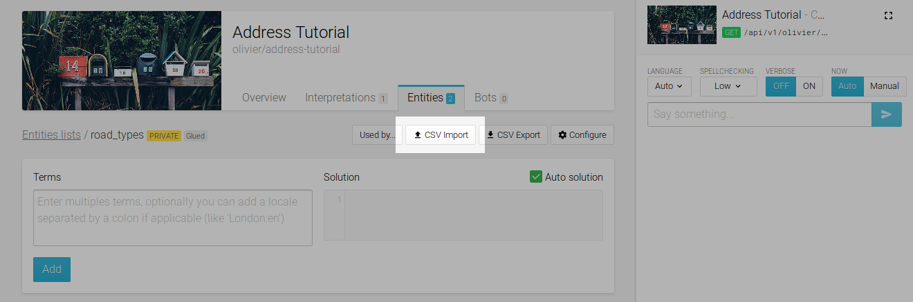
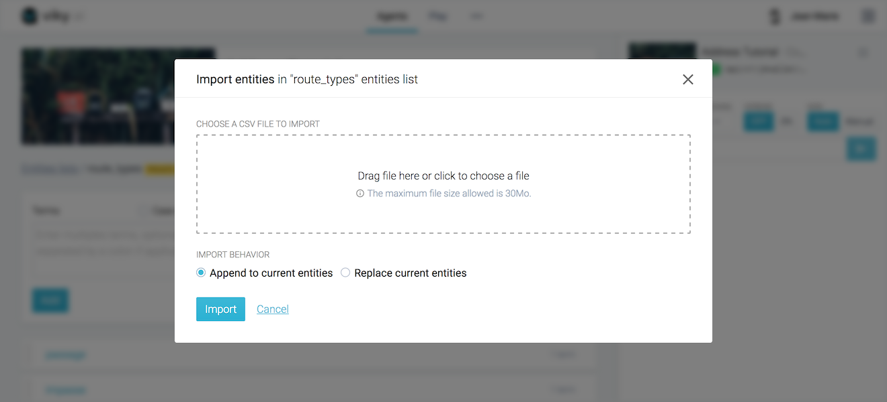
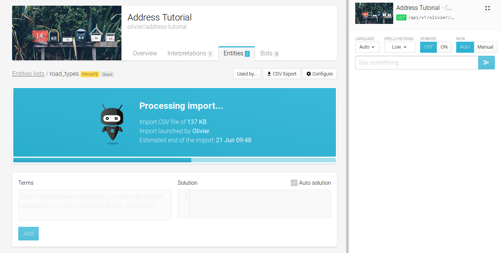
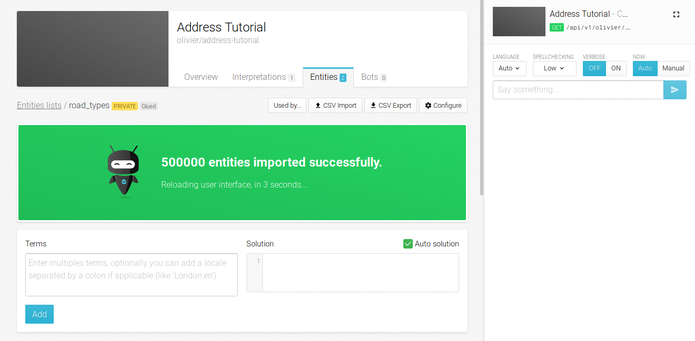
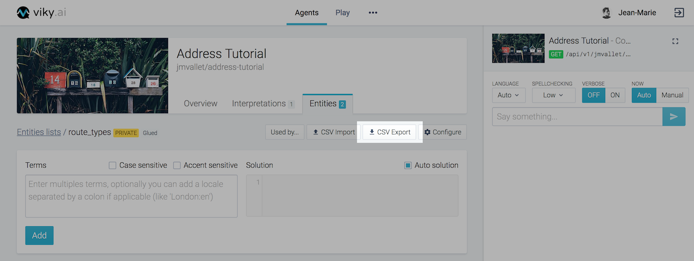

## Purpose

When your agent becomes more complex it will need lots of entities grouped together within lists.
As such, it becomes easier to process those lists in an external tool and then import them into viky.ai.

## File format

The file format is CSV (Comma-Separated Values) UTF-8 encoded. Both entities import and export use this format. It is composed of  3 comma-separated columns, where each line represents a complete entity. Below is an example of content:

```
Terms,Auto solution,Solution
avenue,true,avenue
rue|street:en,true,rue
```

The very first line of the file is the CSV header. It is mandatory and **have to** be: `Terms,Auto solution,Solution`.

The first column contains terms grouped by meaning. A pipe character (`|`) is used to separate them.  The language for each term can be specified after a colon character (`:`). If this information is missing, the language for the term is considered as unknown. At least one term is **required**.

The second column enables (or disables) the auto-solution option. This column **must** contain either `true` to enable or `false` to disable it.

The last column is the corresponding solution. If the `Auto solution` column contains `true` the solution content is replaced by the first term, if it is `false` the solution **must** be present as a valid JavaScript code.

## Import an entities list

Select your agent, go to the entities list tab and open the list that will receive your data.



Only plain CSV files are accepted. An import can either append the file content to the list or replace it entirely. The line order in the file is preserved in the final entities list. Empty lines are ignored.
 
The import process can accept files with a size up to 30 MB.



There can be only one ongoing import at a time on a given entities list. A message will inform you that the import process is running. During this operation, manual updates are disabled.



When the import is finished, the interface will be automatically refreshed.



## Export an entities list

Select your agent, go to the entities list tab, and open the list you want to export. On the list header, press the **Export** button.



viky.ai will offer you to download the corresponding CSV file. Its name has the following convention: `<username>_<agentname>_<entities_list_name>_<current_date>.csv`
