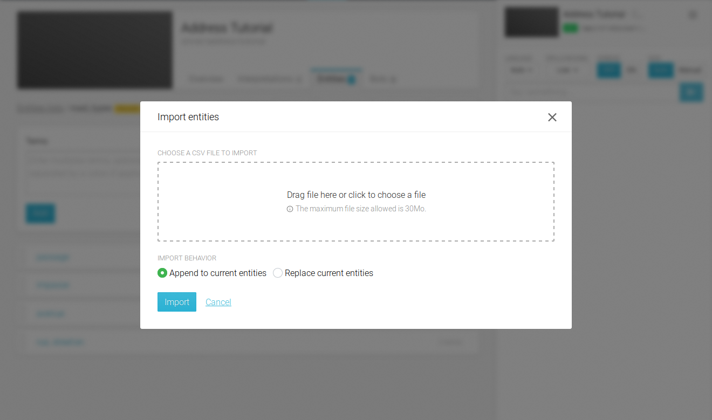

## Purpose

When your agent become more complex it will need lots of entities grouped together within lists.
As such, it will become easier to process those lists in an external tool then import them back into viky.ai.

## File format

The file is formatted as CSV (Comma-Separated Values) data encoded in UTF-8. The same format apply both for import and export. It is structured around 3 columns separated by commas, each line represent a complete entity. Below is an example of content:

```
Terms,Auto solution,Solution
avenue,true,avenue
rue|street:en,true,rue
```

The very first line of the file is the CSV header. Its presence is mandatory and **must** be: `Terms,Auto solution,Solution`.

The first column contains terms grouped together by meaning. They are separated by a pipe character (`|`) and the corresponding language is set after a colon character (`:`). If the language is absent it is considered as unknown. At least one term **must** be present.

The second one enable (or disable) the auto solution option. This column **must** contains either `true` to enable or `false` to disable it.

The last one is the corresponding solution. If the auto solution column contains `true` the solution content is replaced by the first term, if it is `false` the solution **must** be present as a valid JavaScript code.

## Import an entities list

Select your agent, go to the entities list tab and open the list that will receive your data.


Only plain CSV files are accepted. An import can either append the file content to the list or replace it entirely. The lines order in the file is preserved in the final entities list. Empty lines are ignored.
 
The import process can accept files with a size up to 30 MB.



There can be only one import at time on a given entities list. A message will inform you that the import process is running. During this operation manual updates are disabled.


When it is done the interface will automatically refresh.


## Export an entities list

Select your agent, go to the entities list tab and open the list you want to export. On the list header press the **Export** button.


viky.ai will offer you to download the corresponding CSV file. Its name have the following convention: `<username>_<agentname>_<entities_list_name>_<current_date>.csv`
