## Purpose

This guide will assist you in the creation of your first project in viky.ai.

We will guide you to create your first agent to structure information from contents and to retrieve relevant information in these contents by interacting with your data in natural language.

We will demonstrate different capabilities of viky.ai through a very simple use case:

- You have some contents where you want to retrieve the postal address to create some metadata for instance to classify the information.
- Furthermore, you have customers who want to query these contents by searching with a postal address. Queries should be in natural language to facilitate the interactions.

In practice, you will create an agent allowing you to send a text to the [viky.ai Agents API](../../api/agents/) and it will extract the French postal addresses in a structured way.

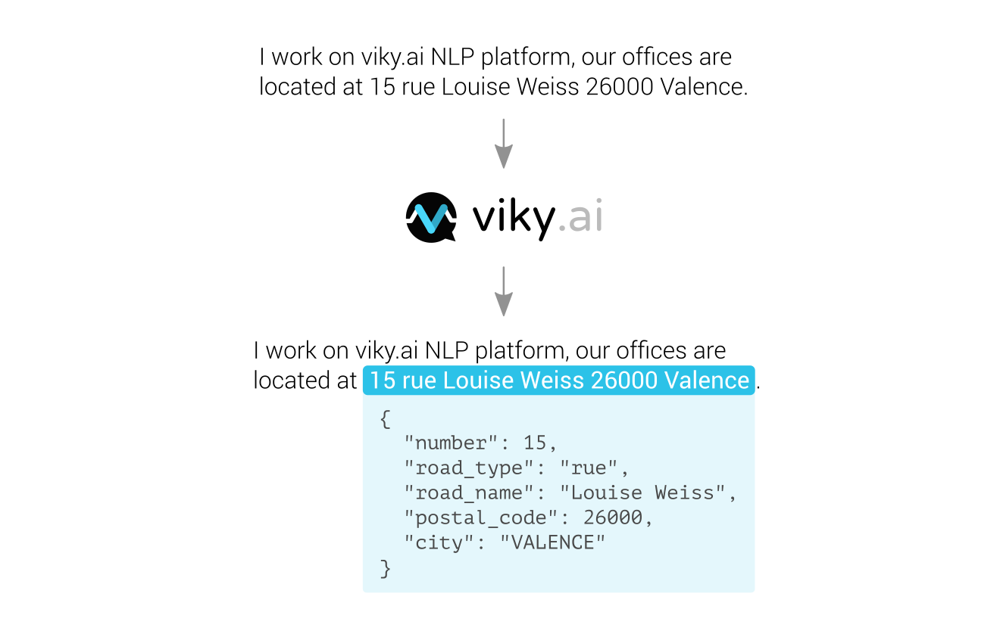

## Best practices to start

**Defining the scope and usage is your first priority before starting** any new project in viky.ai. It will help you create the most appropriate design for your agents.

### What is a postal address?

- A _postal address_ usually contains a route, a street number, a postal code, and a locality.
- It could also contain additional information about the floor, the apartment, the building.
- It would be interesting to have the GPS coordinates of the locality, to use on a map, for instance.

_Postal addresses_ could be slightly different from one country to another. So let's start this tutorial with French postal address!

A typical example is: _12 avenue de Flandres 75019 Paris_ (find some information about postal addresses on [Wikipedia](https://en.wikipedia.org/wiki/Address#France)).

### Can I reuse components or should I create everything from scratch?

Think about the elementary components you will need to create agents that are able to identify a postal address.

In the example "12 avenue de Flandres 75019 Paris", the decomposition into elementary components gives:

<aside class="note">
  <h3>Tips and tricks</h3>
  <p>
    Open resources exist on the web to facilitate the creation of these elements.
  </p>
  <p>
    For instance, route types are available on <a href="https://fr.wikipedia.org/wiki/Odonymie_en_France#Types_de_voie">Wikipedia</a> or on this <a href="https://gist.github.com/384400/bf3c83a4e7d1aa66a87e">GitHub Gist</a>.
  </p>
</aside>

- `12`: Street number
- `avenue`: Route type
- `de Flandres`: Route name
- `75019`: Postal code (i.e. a specific pattern of numbers)
- `Paris`: Locality

Optionally, it could contain information about the apartment, building, floor.

viky.ai already contains some generic agents - numbers and French cities - to help you in this creation.

We will create a module (named *Agents* in viky.ai's world) able to identify each part of the address, and a postal address.


## Create an agent

Login to viky.ai. You will then see an interface listing the available agents. Then click on the **New Agent** button.


A modal box with the form "Create a new agent" opens.

<aside class="note">
  <h3>Tips and tricks</h3>
  <p>
    <code>ID</code> must be URL compatible. Use unaccented, lowercase characters and separate the words with a dash (<code>-</code>).
  </p>
</aside>

1. Fill the `Name` field with "Address Tutorial".
2. Set the `Visibility` to `Private`, so that you will be the only user to see this agent.
3. Fill the `ID` field with "address-tutorial".
4. Check the following options for languages: `No language`, `fr (french)` and uncheck `en (english)`.
5. Choose a background color or upload an image.
6. Submit the form with the **Create** button.


The agent is now created. By default, you land on the **Overview** tab of the agent.

On the left part of the UI, you can edit agent's configuration, manage access rights, dependencies and add a Readme to describe your agent. On the right part, a console allows you to play with the agent, but we will come back to it later.

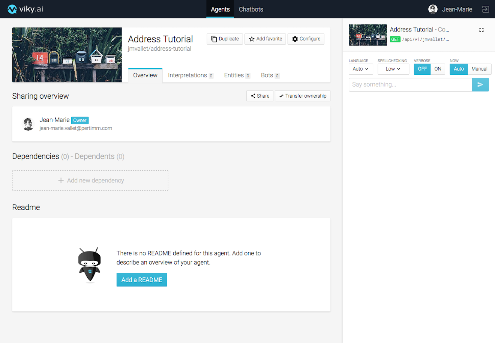

<aside class="primary">
  <p>
    You can add a <strong>Readme</strong> in this <strong>Overview</strong> section. This is particularly useful to describe the purpose of your agent, and add some examples of what it will be able to do. For this tutorial, copy and paste the purpose of the tutorial in the <strong>Readme</strong> section. Add the following examples of French postal addresses as an illustration (it will also serve as unitary tests during the agent creation). Examples should be as representative as possible.
  </p>
  <ul>
    <li>12 avenue de Flandres 75019 Paris</li>
    <li>108 rue Jean Moulin 54230 Neuves-Maisons</li>
    <li>240 Impasse du Fief du Breil 44690 La Haie-Fouassière</li>
    <li>3 Passage Pommeraye 44000 Nantes</li>
    <li>1 Rue de la Miséricorde 20200 Bastia</li>
  </ul>
</aside>


## First basic interpretation

### Create an interpretation

In the **Interpretations** tab, click on the **New Interpretation** button.


<aside class="note">
  <h3>Interpretation visibility</h3>
  <ul>
    <li>Public interpretations are those exposed by the agent; they provide final solutions.</li>
    <li>Private interpretations are used to perform intermediate calculations or computations.</li>
  </ul>
</aside>

A modal box with the form “Create a new interpretation” opens.

1. Fill the `ID` with "address".
2. Set your interpretation visibility to **Public**.
3. Fill a description: "Identifies the French postal addresses."
3. Click on the **Create** button.


### Create your first expression

Your first interpretation is created. Now click on it and select the **fr** tab. Type "12 avenue de Flandres 75019 Paris" in the text area, then click on **Add**.

Keep the default options (_keep order_, _close_, _auto solution_) as is. We will come back to them later.

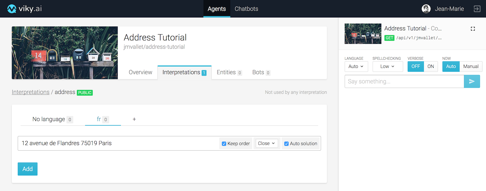

### Testing the agent

A console panel is on the right to test in live your agent. Type "12 avenue de Flandres 75019 Paris" in the text field and click on the arrow to send the request. This console calls your agent by REST API.

You can see the returned solution in the **Explain** tab (opened by default). The solution is also available in JSON format; click on the **JSON** tab to see it.


The returned value is the interpretation you just created and the score is the match confidence level: 0 means no match, and 1 means an exact match. Here the score is 1 because the sentence typed in the console exactly matches the expression you just created.

<aside class="primary">
  <p>
    The <strong>Console</strong> has multiple usages. It could be a place to realize your <strong>manual unit tests</strong>, validate an interpretation each time you create a new one.
  </p>
  <p>
    It also allows to save your tests to create an <strong>automated tests suite</strong>. A best practice to have in an NLP project is to have continuous improvements with a view of potential regressions.
  </p>
</aside>


## Route types

You want to be able to identify any _French postal address_ with other street number, route types and names, and localities.

We will start with the route types detection by using an entities list.

### Create a route type entities list

Click on the **Entities** tab and click on the **New entities list** button.


<aside class="note">
  <h3>Naming conventions</h3>
  <ul>
    <li>Names are always in English.</li>
    <li>Favor the singular form to name an interpretation.</li>
    <li>Favor plural form to name an entities list.</li>
  </ul>
</aside>

A modal box with the form "Create a new entities list" opens.

1. Type "route_types" in the `ID` text field.
2. Select **Private** and **Glued** options.
3. Click on the **Create** button.

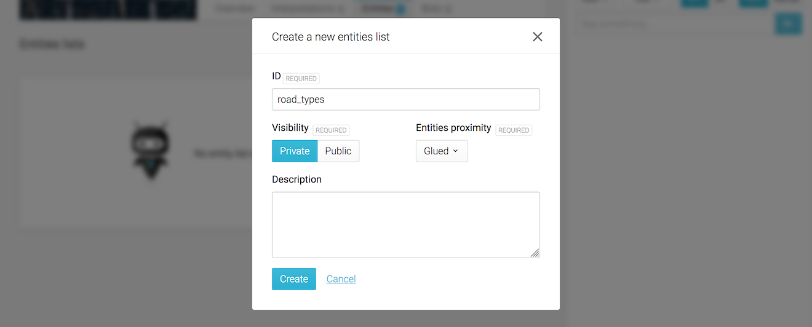

Click on the entities list you just created to open it and enter route types names:

1. Type "rue" in the **Terms** text area ; then click on **Add**,
2. Type "avenue" in the **Terms** text area; then click on **Add**,
3. Type "impasse" in the **Terms** text area; then click on **Add**,
4. Type "passage" in the **Terms** text area; then click on **Add**,


<aside class="primary">
  <p>
    It is also possible to import long lists of entities into viky.ai with a CSV file.
  </p>
</aside>


### Link entities list to interpretations

Go back to the **Interpretations** tab, click on the **address** public interpretation.

<span class="tag tag--primary">Step 1</span> <strong>Edit the current expression in address interpretation</strong>

Click on the expression "12 avenue de Flandres 75019 Paris" in order to edit it.


<span class="tag tag--primary">Step 2</span> <strong>Link avenue with route_types entities list</strong>

1. Highlight **avenue** in expression "12 avenue de Flandres 75019 Paris".
2. A drop-down list appears displaying the different interpretations and entities lists available.
3. Choose the **route_types** entities list (it should be labeled like `yourname/youragent/entities_lists/route_types`).
4. Click on **Update**

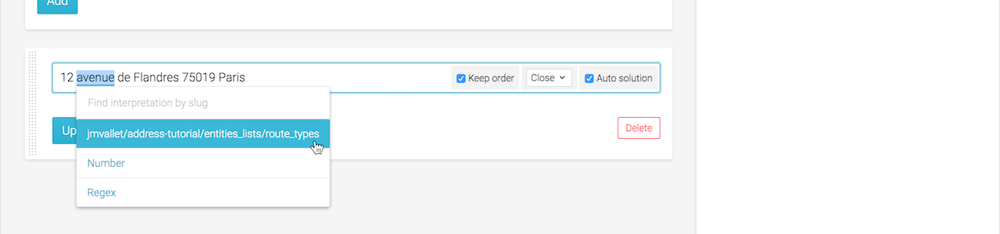

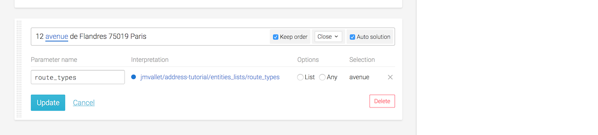

<span class="tag tag--primary">Step 3</span> <strong>Validate</strong>

Test in console the interpretation with the following sentences:

- 12 impasse de Flandres 75019 Paris
- 12 avenue de Flandres 75019 Paris
- 12 rue de Flandres 75019 Paris

All sentences are successful, the interpretation **address** is found on each route type variant.


## Street number, postal code & locality

Let's continue with the detection of street number, postal code and locality.

### Let's add some dependencies

In order not to reinvent the wheel, you will add 2 agent dependencies as seen above:

- **Numbers** agent will allow you to understand ordinal and cardinal numbers written in digits or in letters. This seems appropriate to recognize street number and postal code.
- **VillesFR** agent will allow you to recognize French cities and give you their geographical coordinates. This seems appropriate to recognize locality.

To do this, return to the agent **Overview** tab.

<span class="tag tag--primary">Step 1</span> Click on **Add new dependency**.


<span class="tag tag--primary">Step 2</span> Search and choose the **Numbers** public agent.


<span class="tag tag--primary">Step 3</span> The **Numbers** agent is now in your dependencies.

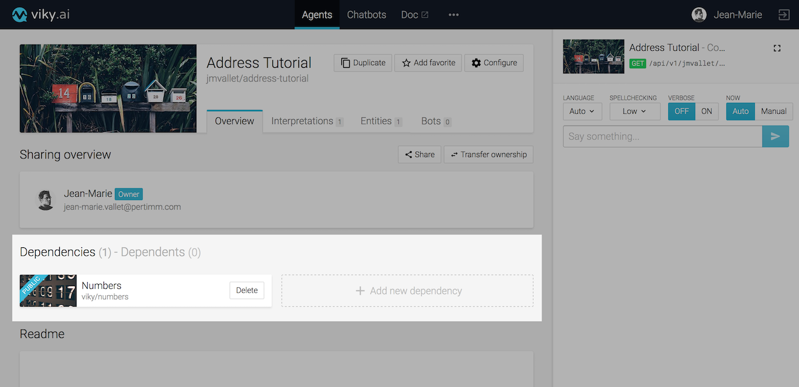

<span class="tag tag--primary">Step 4</span> Let's add other dependency. Click on **Add new dependency**, search and choose the **VillesFR** public agent.


<span class="tag tag--primary">Done</span>  Now, both dependencies are in place.

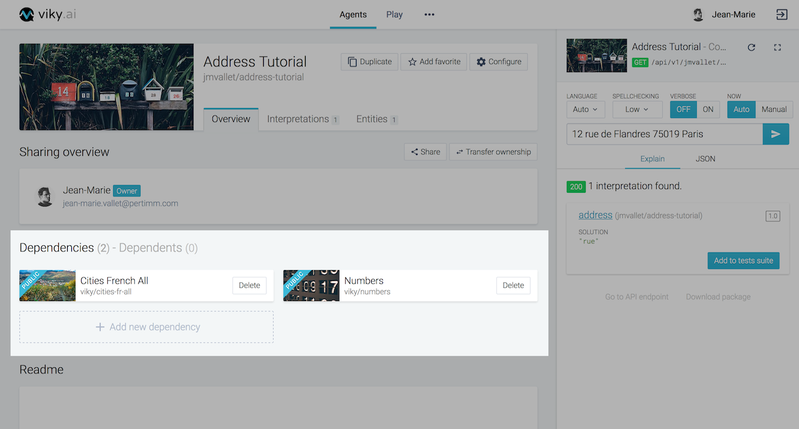


### Edit address interpretation

In order to make the agent understand the street number, postal code and locality, go to the **Interpretations** tab. Then go to the **address** interpretation and edit the "12 avenue de Flandres 75019 Paris" expression.

Let's start making highlights:

1. Highlight "**12**" and create an alias to the `viky/numbers/interpretations/number` interpretation.
2. Highlight "**75019**" and create an alias to the `viky/numbers/interpretations/number` interpretation.
3. Highlight "**Paris**" and create an alias to the `viky/villesfr/interpretations/cityfr_entities` interpretation.

Don't highlight the route name for the moment, we will come back to it later.

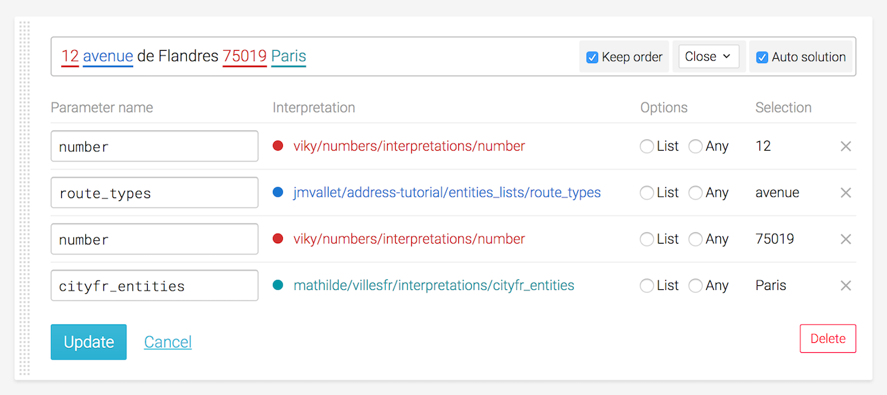

If you try to update the expression, an error will be displayed because the parameter name `number` is used twice.

In parameter name column:
1. Replace the first `number` value by `street_number`.
2. Replace `route_types` value by `route_type`.
3. Replace the second `number` value by `postal_code`.
4. Replace `cityfr_entities` by `locality`.

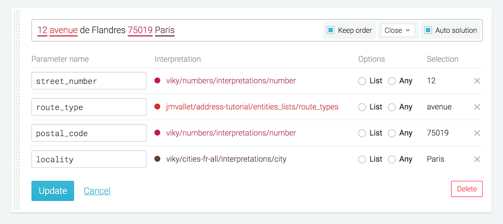

Click on **Update** in order to save these modifications.

### Validate in the console

Now test the sentence "12 avenue de Flandres 75019 Paris" in the console.

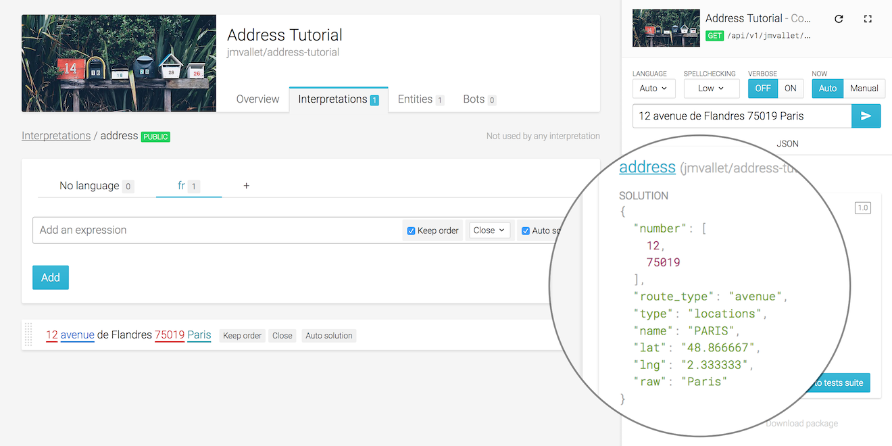

Every part is understood correctly, but the solution is quite verbose.

We will now customize the output in order to make it simpler to read.


### Improve solution output

Open the expression and uncheck **Auto solution**. A textarea is now open at the bottom of the form.

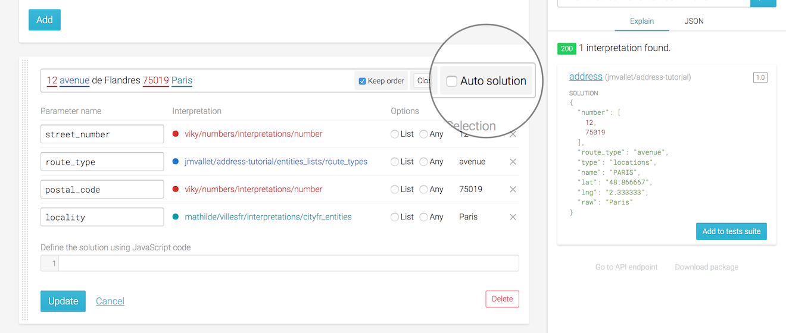

This textarea allows you to customize the solution. The solution is a json map, and you can use all the variables listed in the **Parameter name** column.

Update the solution in order to have a solution like this:

```javascript
{
  "street_number": street_number,
  "route_type": route_type,
  "postal_code": postal_code,
  "locality": locality
}
```

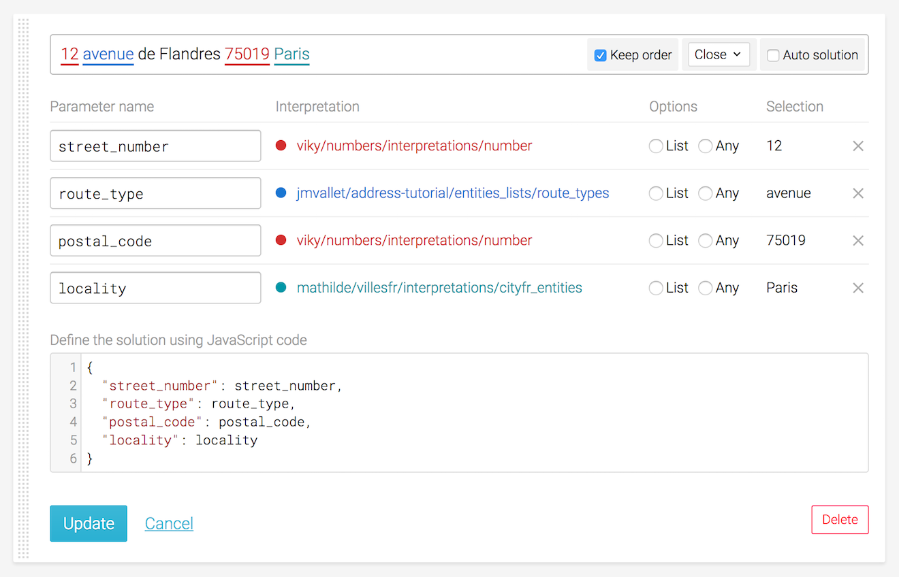

The solution now becomes:


This is much more readable, but it is still not completely OK. Let's remove the extra **number** and only keep the locality name for the moment.

Replace the current solution with:

```javascript
{
  "street_number": street_number.number,
  "route_type": route_type,
  "postal_code": postal_code.number,
  "locality": locality.name
}
```

The solution is much better now:

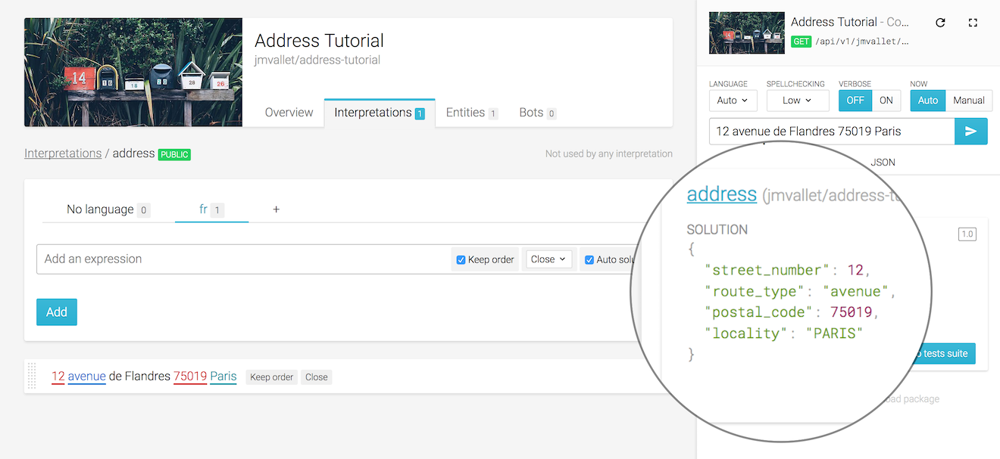

## Route name

We will now try to understand the route names.

### Route names entities list

There are too many route names to import them all in viky.ai. Instead we will try to make the agent understand unknown route names.

First create a new private entities list **route_names**.

Fill it with some common route names such as **Champs Elysées**, **Rivoli**, etc...

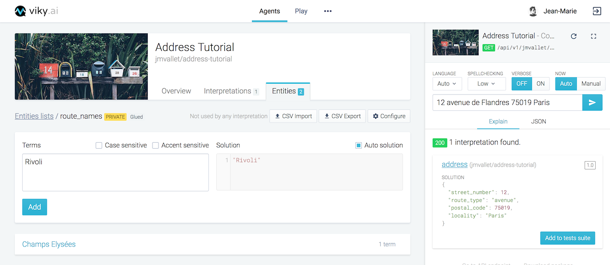


### Edit address interpretation

Go back in the **Address** interpretation, edit the expression as:

1. Highlight **de Flandres**.
2. Create an alias to the entities list **route_names**.
3. Select **any** for this alias.
4. Replace parameter name `route_names` value by `route_name`.
5. Update solution with the code below.
6. Click on Update button.

```javascript
{
  "street_number": street_number.number,
  "route": route_type + " " + route_name,
  "postal_code": postal_code.number,
  "locality": locality.name,
}
```

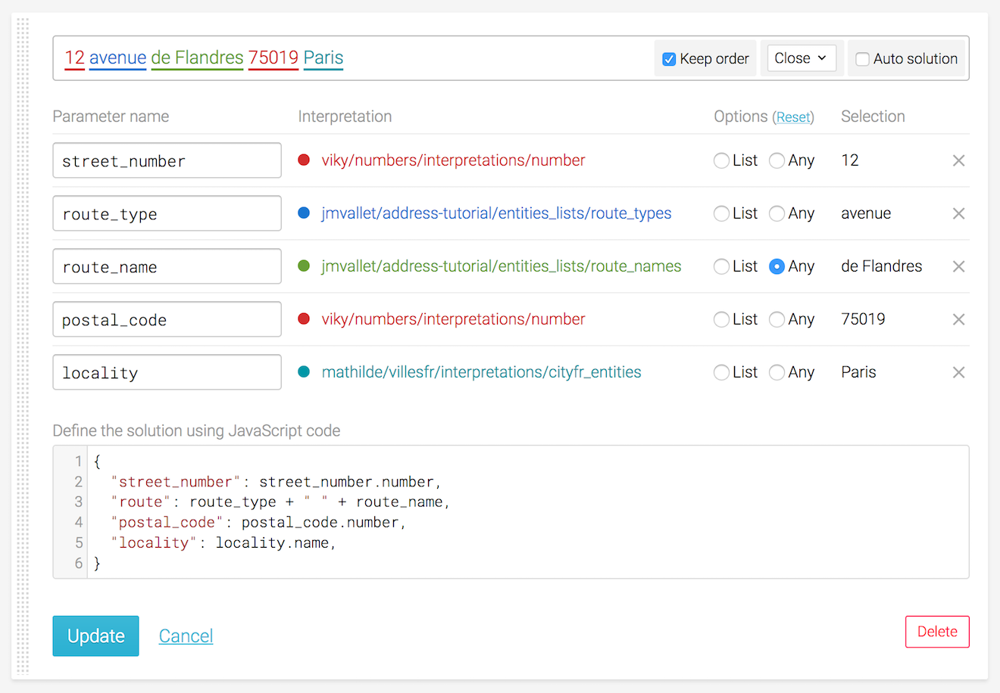

In the console, test the sentence "12 avenue de Flandres 75019 Paris" now. Every part is understood correctly, even the route name.

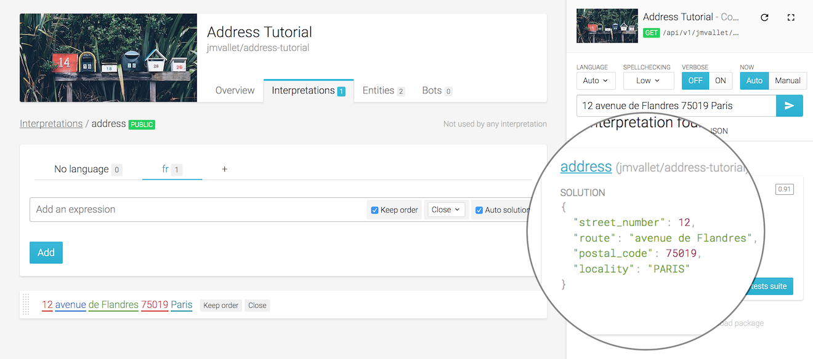

Try a completely different address, for example "108 rue Jean Moulin 54230 Neuves-Maisons". It works too!

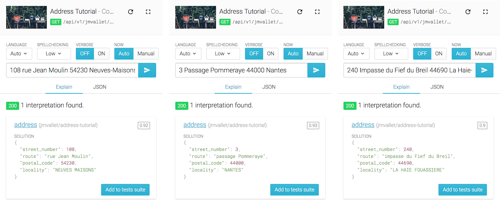

Congratulations! You now have your very own agent in viky.ai that can recognize simple French postal addresses.

viky.ai does not limit you to use your agents within the platform. In the following section,
we will show you how you can access your agent through an external application.

## Connect with your agent

In this last step you will use your agent's abilities from your own application.
Every agent in viky.ai is reachable through a [public REST API](../../api/agents). To access the API, you will first need the agent's API token. You can find it in the configuration panel in the agent's overview screen.

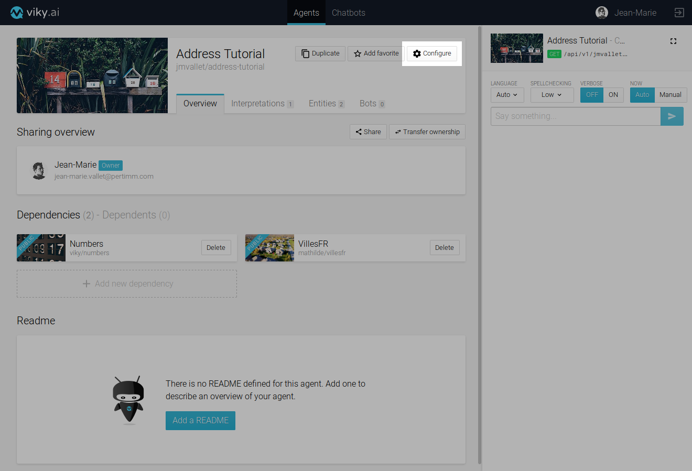

The API token is a 32 characters unique identifier that the developers must provide to prove that they are allowed to consume this agent.


Then, any HTTP client library will be able to send a sentence to the agent and get back the corresponding solution.
A quick connection check can be made with a simple `curl` call:

```bash
$ curl -G "https://viky-beta.viky.ai/api/v1/agents/<your_username>/address-tutorial/interpret.json?" \
       -H "Agent-Token: <agent_token>" \
       --data-urlencode "sentence=12 avenue de Flandres 75019 Paris"
```

The HTTP response is the expected JSON:
```json
{
  "interpretations": [
    {
      "id": "<interpretation_id>",
      "slug": "<your_username>/address-tutorial/interpretations/address",
      "name": "address",
      "score": 0.91,
      "solution": {
        "street_number": 12,
        "route": "avenue de Flandres",
        "postal_code": 75019,
        "locality": "PARIS"
      }
    }
  ]
}
```
