This section will show you some tips and tricks in the platform.

## Recognizing a pattern

Sentences can most often times contain phrases that follow a certain pattern. Agents in viky.ai can be easily configured to understand such patterns.

Let us again take the `Address Tutorial` agent that we created in the [Getting started](/doc/guides/getting-started/) section.

In our expression for the **address** interpretation, we had created an alias to `viky/numbers/interpretations/number` for the postal code. However, if we check the French postal code system, they are always of 5 digits. But, our agent recognizes any length of number as postal code. Let us correct that.

Edit the expression "12 avenue de Flandres 75019 Paris". Remove the alias to `viky/numbers/interpretations/number` for the postal code.


Highlight "**75019**". This time select `Regex` from the list. You will be prompted to enter a regular expression. In the text box enter `[0-9]{5}`. Also update your solution as follows:

``` javascript
{
  "street_number": street_number.number,
  "route_type": route_type,
  "route_name": route_name,
  "postal_code": postal_code,
  "locality": locality.name
}
```

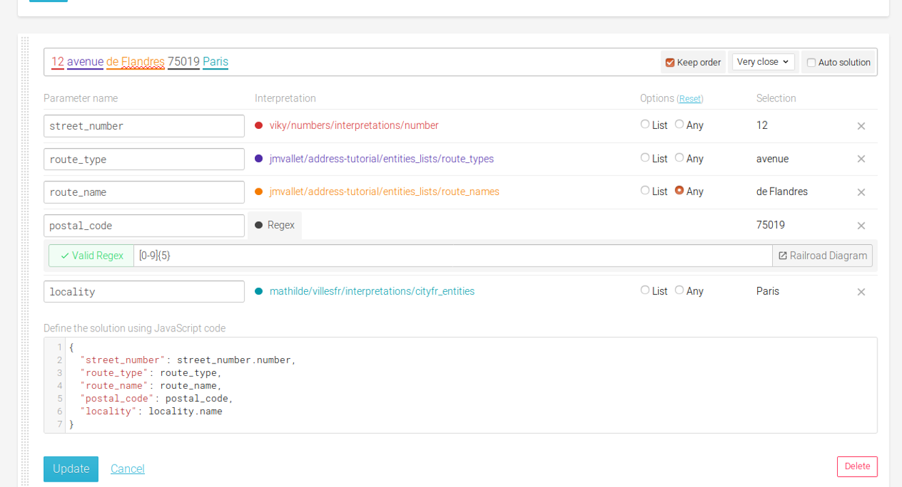

Now your agent recognizes the postal code correctly.

You can similarly make your agents recognize patterns such as telephone numbers, emails and so on using `Regex`.

## Interpretation with a list of similar phrases

Let us again go back to our `Address Tutorial` agent. An address can contain additional information such as the apartment number, building number, floor number and so on. These are all optional information in an address.

Addresses with additional info can take the form of any one of the following:
* Apt 2, 12 avenue de Flandres 75019 Paris
* Apt 2, Batiment B, 12 avenue de Flandres 75019 Paris
* Apt 2, 1er étage, Batiment B, 12 avenue de Flandres 75019 Paris

Let us see how we can incorporate this in our agent.

One way would be to create separate expressions for each of these sentences. However, the better and non repetative way is to treat this additional information in the address as a list. Let us see how we can do this.

Let us first create a few components that will recognize the additional information in the address.

<span class="tag tag--primary">Step 1</span> Create an entities list `building_components` which contains the terms "batiment", "etage" and "apartment".


<span class="tag tag--primary">Step 2</span> Create a private interpretation `supplementary_address` to recognize the additional information in an address. Add the following expressions in the interpretation:
* Add "Apt 1" as your first expression.
  * Highlight "Apt" and create an alias to the `building_components` entities list you created earlier.
  * Highlight "1" and create an alias to `Regex` type. Enter "[A-Za-z0-9\S]+" in the text box for regular expression.

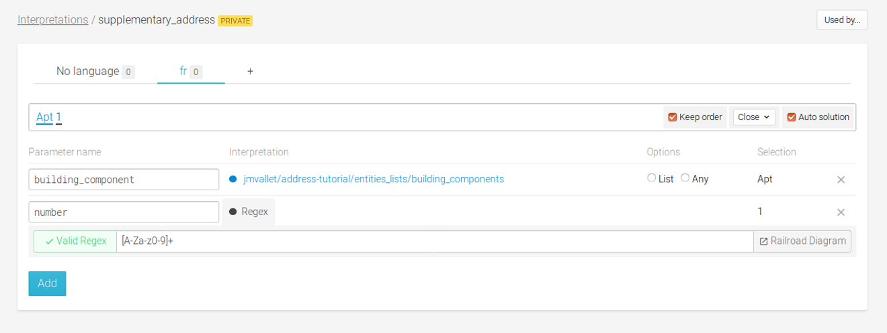

* Add "1er étage" as your second expression.
  * Highlight "1er" and create an alias to `viky/numbers/interpretations/number_ordinal`.
  * Highlight "étage" and create an alias to the `building_components` entities list.

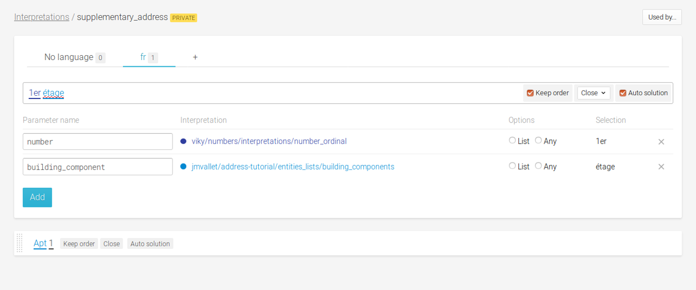

Now that we have an interpretation to recognize the additional information in an address, let us create an expression for addresses with additional information.

Add an expression "Apt 2 12 avenue de Flandres 75019 Paris" in the **address** interpretation. Create highlights as follows:
1. Highlight "Apt 2" and create an alias to the `supplementary_address` interpretation you created in the previous step. Select the option `List`.
2. Highlight other part of the address like before.


Test the expression "Apt 2 12 avenue de Flandres 75019 Paris" in the console.


You can see that the solution for the additional information is structured in an array. The `List` option that you selected for alias to the `supplementary_address` interpretation tells the NLP that it can contain more than one number of such interpretation. That is why the solution is structured in an array.

Let us test some other expressions with building information, floor numbers, etc.


Your agent can now recognize addresses with multiple additional information.


## Manage an open entiyties list (any)

In some cases, it can be very interesting to match a word that is not known from the system thanks to the sentense structure around.
For example, in the sentence "I want to go to Cucuron for next summer"
Actually, Cururon is a small french town but very few people know it and your agent may not know it. But it can be recognized thanks to the sentence structure, knowing that what's following the words "I vant to go to" must be a place.
To do so, the word to be understood has to be annotated as "any"

### Basic Example

Let's create an agent **test_any**
Let's create in this agent a private entities list named **cities** containing only 3 french cities : **Paris**, **Lyon** and **Marseille**
Let's create in this agent a private entities list named **want_go** containing only 1 sentence : "I want to go to"
Let's create a public interpretation named **destination**organized as below

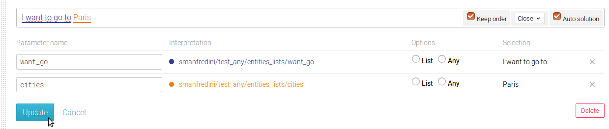

If, in the console, the sentence "I want to go to Paris" is typed, the returned city is "Paris"
If, in the console, the sentence "I want to go to Cucuron" is typed, the sentence is not recognized


To be able to recognize this unknown town, simply set the **any** annotation on, as below


Then, you can retry the sentence "I want to go to Cucuron", the sentence is correctly recognized.

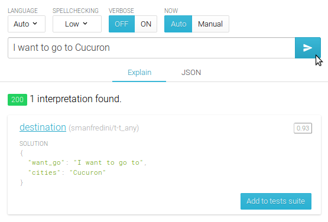


### Restrictions

The use of the **any** annotation is very powerful, but it can also be dangerous because it can create false positive matches.
To avoid this, 2 controls have been integrated in viky.ai

The first one : an any annotation cannot be added when no other annotation is set in the formulation


The second one : Only 2 any can be taken into account for a sentence matching. With more than 2 any, the match will be considered as random, as it will introduce too much noise.


## Match on "New york", but not on "York New" (Keep order)

It is possible to match an expression by respecting the order or not.
This can be interesting when the structure of the sentence is important, to match precisely, or, on the opposite, to have a very flexible match.

For example, for the numbers, the order is very important : hundred two is very different from two hundred, and in this case, the order must be kept.
On the opposite, when registering a reservation, the options can be given in an undefined order : "I want an hotel with a spa for christmas" is the very same thing as "I want an hotel for christmas with a spa"

This can be handled with the **keep order** annotation
This annotation has to be set by formulation and is covering a whole formulation

Example :

Let's create an agent names **test keep order**
Add a public interpretation called **new-york**
In this interpretation, create a formulation for **new york**
By default this formulation has the **keep order** annotation activated


If, in the console, you enter **new york**, it will match, but if you enter **york new** it will not


To accept it, uncheck the **keep order** annotation in the formulation


Then retry the sentence, it works


## Match on "I want cofee" and "I want a cofee" with the same interpretation (Proximity)

It can be very convenient to accept a few extra words in a formulation, as it can be very powerful to be very strict on the definition of what is accepted or not

For example : the sentences "I want cofee", "I want **a** cofee" and "I want **some** cofee" are exactly the same whereas no word must be accepted between "new" and "york" in the name of the "new york" city.

To illustrate it, let's create an agent named **test proximity**
Create a public interpretation named **want_cofee**
In this interpretation, create a formulation containing "I want cofee"

By default, the proximity is set to **close**


the possible values are :
* **glued**: no ewtra word is allowed
* **glued + punc**: only punctuation is allowed between 2 consecutive matched words
* **very close**: approximatively 1 word (8 letters) is allowed between 2 consecutive matched words
* **close**: approximatively 3 words (20 letters) are allowed between 2 consecutive matched words
* **far**: approximatively 8 words (50 letters) are allowed between 2 consecutive matched words

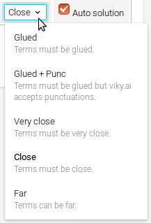

Set the value to **glued**

In the console, type the sentence "I want cofee", it matches


But the sentence "I want a cofee" does not match


If the proximity is set to **very close**, "I want a cofee" will match, but "I want some good cofee" will not
And if the proximity is set to **close**, "I want some good cofee" will match too


## Case sensitive/Accent sensitive

When matching cities names, for example, it can be interesting to match with case and accent.
For example, **Bar** is a town in france and **bar** is the french word for pub. Being case sensitive can make the difference between the 2 words here.

This can be handled in the entities lists. each entity can be set as **Case sensitive**  or **Accent sensitive**

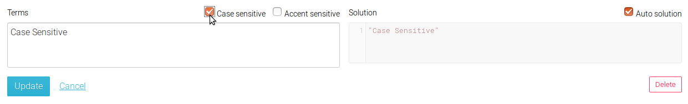

When options **Case sensitive** or **Accent sensitiv** are set on, a label is displayed in front of the collapsed entity

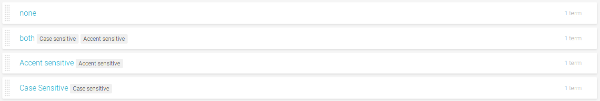

These options can be set on csv import
the csv import file format is :

```
  Terms,Auto solution,Solution,Case sensitive,Accent sensitive
```


## Duplicate an agent

There are many public agents in viky.ai. These agents can be explored and tested by everyone in the platform. What if you find an agent that you would like to work with but you do not have the required access rights to it? Yes, you can create your own that has the same structure and behave the same. But it would be very tedious to do so for a complex agent.

Viky.ai allows you to duplicate any agent that is visible to you. When you view an agent, you can find a `Duplicate` button at the top of the `Overview` tab.

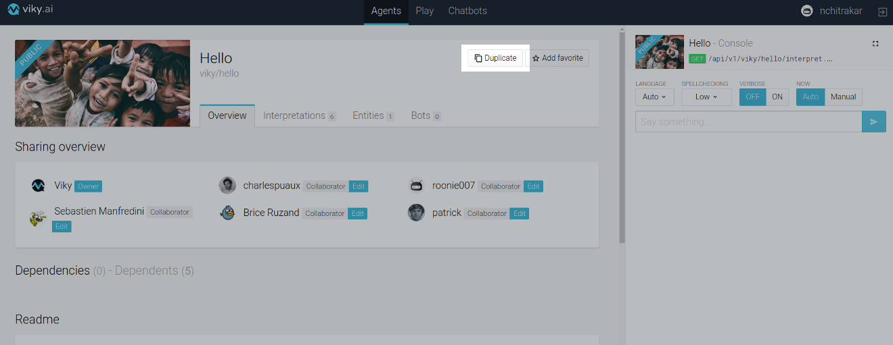

Click on the `Duplicate` button. Voila!, you have your very own agent that behaves exactly the same with just a click of a button. You can now edit and change the agent as per your requirements.

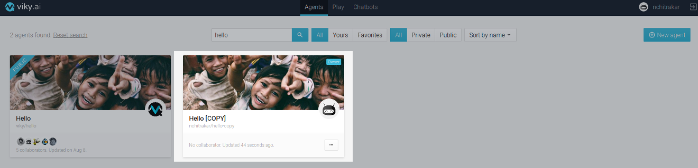


## Drag and drop/ Move to

Moving an interpretation from public to private or from private to public can be done by clicking on the configuration button

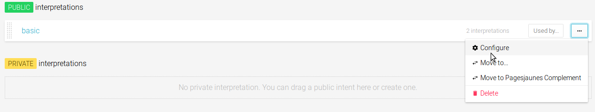

and setting the visibility

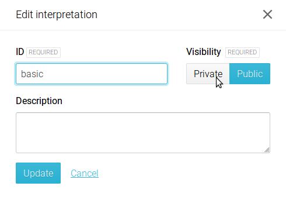

But this is quite annoying and takes time
There is another way to do it, simply by dragging and dropping it.
To do so, click on the dashed zone on the left part of the interpretation, then drag and drop it to the desired place

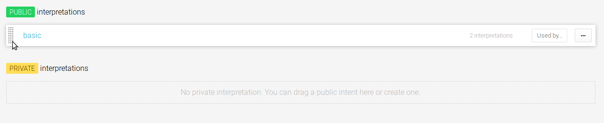


## Now in tests

defining tests using time can be a problem : the sentence "in 2 days" will change answer every day and the test will fail.


A solution for it is to set the "now" to a given value in order for these result not to change anymore
It also allows you to set the "now" to special dates in order to check special configurations (leap year, for example)


