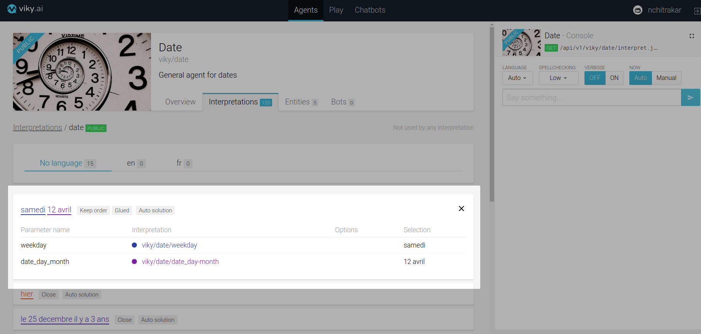
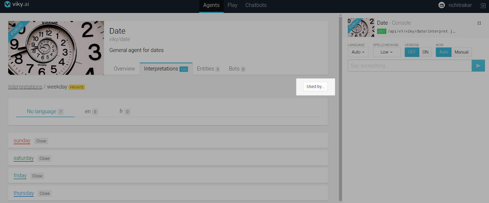
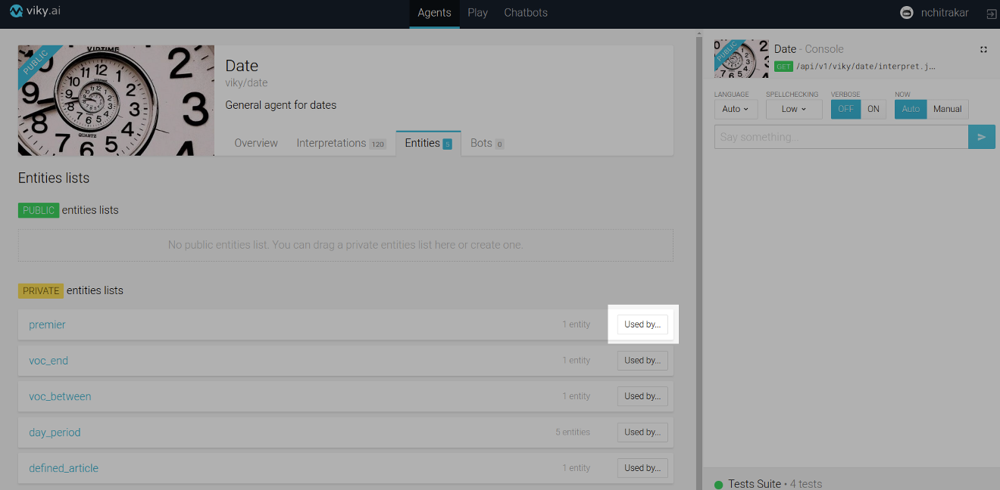
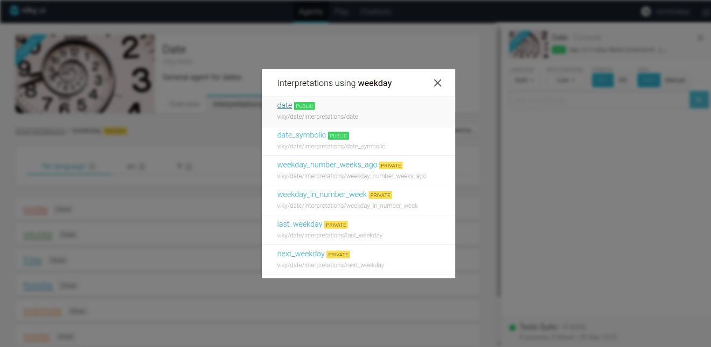
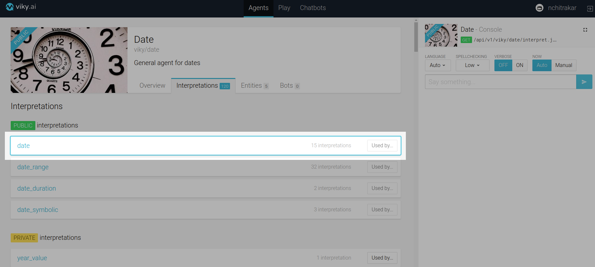
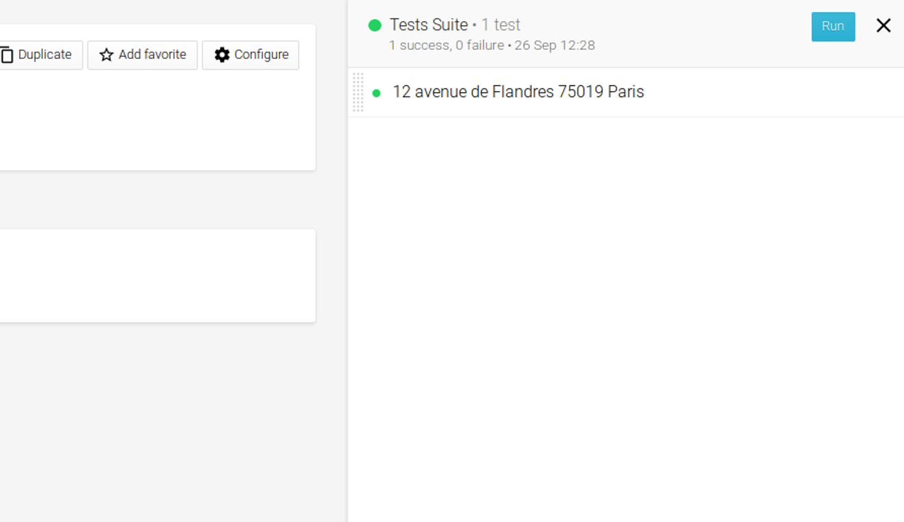
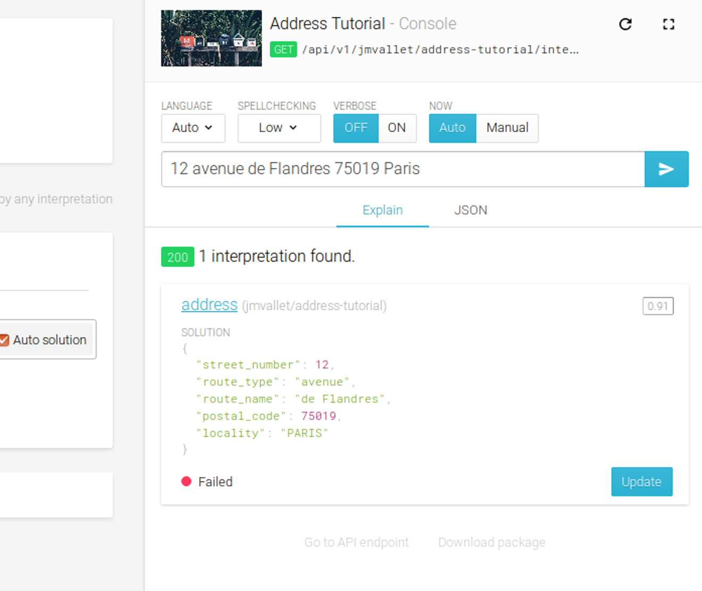
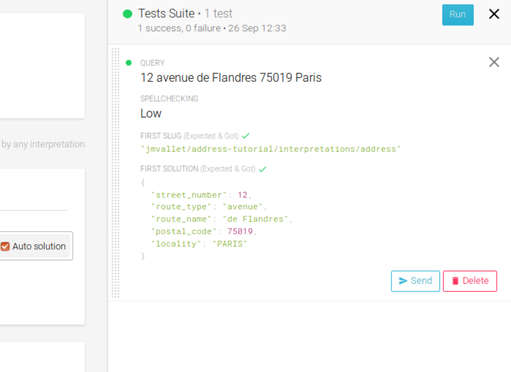

As you develop your agent with many interpretations and entities lists and possibly some dependencies, you may need to troubleshoot your agent. In order to do so you may have to get the exact picture of the structure of the agent or know how it is interpreting various sentences provided to it. This guide will show how the platform helps you in these aspects.

## Understanding interpretation dependencies

An expression of an interpretation can contain aliases to other interpretations and entities lists. This creates dependencies among the interpretations and the entities lists.

Let us try to explore these dependencies in an existing agent, **Date** in viky.ai

A top-down approach to exploring the agent is pretty straight forward. Just click on the desired interpretation in the list and the list expands to show you what other interpretations or entities lists this particular interpretation refers to.



A bottom-up approach would be to see if this particular interpretation is being used by any other interpretations. You can find a `Used by...` button on the top right corner of the interpretation detail view. A `Used by...` button is also available in the rightmost corner for each interpretation in the interpretation list. This same option is available for entities lists as well.





This `Used by...` button is disabled if the interpretation or entities list is not used by any other. On the other hand, if it is used, clicking on it shows the list of interpretations that are using it in a pop up. 



The pop up list also allows you to navigate to the interpretations and entities lists in the list. Just click on one and the platform redirects you to the clicked interpretation/entities list. The platform scrolls to as well as highlights the clicked interpretation or entities list.



Thus, you can easily understand how the interpretations and entities lists of an agent are structured.

## Understanding how a sentence is interpreted

The console panel allows you to test your agent by sending interpret requests. It responds with matched interpretations as well as the solution for the sentence. The console panel's functionality is not just limited to that. It allows you to explore in detail how your agent interprets each word in your requested sentence. 

Let us see how an agent dedicated for currencies in viky.ai interprets the sentence "100 euros". 

To explore, turn the `Verbose` mode `ON` and send the request. The `Explain` tab will now have three sections for each of the interpretations matching the sentence.

1. `Scores` section shows how the score was calculated.
2. `Highlight` section shows which words of the sentence were matched by the interpretation.
3. `Solution` section gives the corresponding solution for the sentence.


The `Highlight` section further allows you to see how the NLP matched each word with the interpretations and entities lists of the agent. Just click on one of the highlighted words. Let us click on "euros". 


You will see a list of interpretations and entities lists matched for "euros". If you watch closely, the first item in the list is the minimal interpretation matching the word. The interpretations and entities lists in the list are arranged in a tree fashion with the last one being the one that incorporates all the interpretations and entities lists above it.

You can even navigate to interpretations or entities lists from that list. Click on the first item in the list, in our case the `money_entity` entities list and the platform takes you to the exact expression within the clicked entities list that matched the word, "euros".


This gives you an exact idea how NLP breaks down your sentence to match the interpretations of the agent.

## Regression tests for your agent

Your agent can go through many changes. So you need to make sure that with every change your agent still behaves the way you want it to. Viky.ai has the notion of regression tests to help you do so. 

Let us see how we can create a regression tests suite for the `Address Tutorial` agent that we created in the [Getting started](/doc/guides/getting-started/) section. 

Every time you ask your agent to interpret a sentence, you will be given an option to add the sentence to the test suite. Type "12 avenue de Flandres 75019 Paris" in the text field of the console and send the request. You will see a `Add to tests suite` button on the bottom right corner of the `Explain` tab.


Click the button. You will now see that a `Tests Suite` has been created at the bottom of the console. You can see the summary of your test suite there.


Click on the summary. You will now see the tests suite with the test that you previously added.



Clicking on the test will show you its details: 

* `Query` i.e. the sentence for the test
* Different options chosen during the interpret request: `Spellchecking`, `Language` and `Now`
* `Slug` of the first interpretation found for the sentence and
* `Solution` for the sentence


Till now you can see that the `Tests Suite` is green which means all the tests have passed. The test details shows us that the expected and got values for the slug and the solution match. 

Let us try to edit our agent and see what happens to the tests suite.

Edit the solution for the expression in address interpretation as below:
```javascript
{
  "street_number": street_number,
  "route_type": route_type,
  "route_name": route_name,
  "postal_code": postal_code,
  "locality": locality
}
```
 

As soon as you updated your interpretation, you will see that the tests suite ran the test and updated its result. You will now see that the test has failed. You can also see what failed in the test - in our case its the solution that did not match. The test detail shows what was the expected solution and what solution was returned.


Click on the `Send` button. It prompts the console to interpret the sentence again. You will see that the console now returns the new solution that we just updated earlier.

 

The console also indicates that the test for this sentence is in failed state. Click on the `Update` button. You will see that the test passed and the expected solution for the test was updated with the new solution.

 

Hence, you saw that with every change in your agent, your tests suite will run and tell you if the tests you added passed or failed with your new changes. You can add multiple tests for different types of sentences that your agent can interpret. You can now be sure that your agent behaves as expected whenever you make any changes.

Another aspect of the regression tests can be when you explore other agents in viky.ai. You can check out their tests suite and understand what kind of sentences the agent is able to understand without having to go through the interpretations and entities lists.


