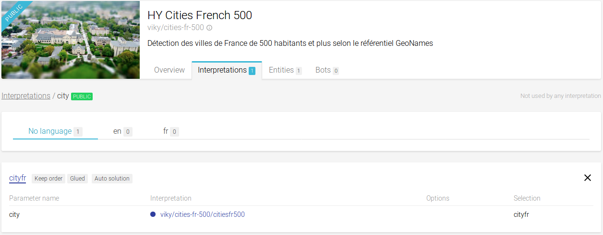
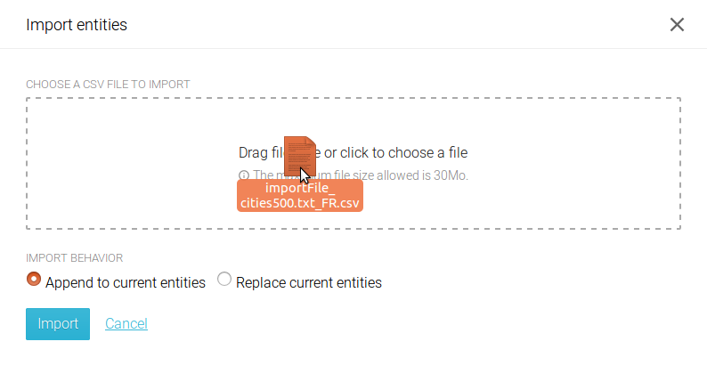
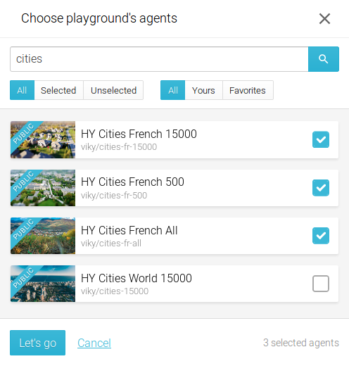
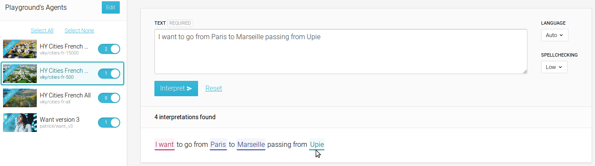

Developping an agent can be done in many different ways according to the agent that is required.
Here are a few examples of use cases

## Creating an agent recognizing all the french towns

Recognizing all the french town can be useful for example to integrate in a bot displaying on a map all the towns mentionned in a text.

The agent to be created here is a basic agent, containing only data and having no specific intelligence or syntax.

### Creating a basic agent

The agent to be created will be constituted of just a public interpretation and a private entities list, the interpretation referring to the entities list

1. Start creating the basic agent, named **French towns**
2. Create a private entities list named **towns** and let it empty
3. Create a public interpretation named **town**, and create a formulation referring to the **towns** entities list

### Getting an import file

The most difficult part is to find an adequate data source in the correct format.
In our case, the data from geonames.org can be a good source, but the format is not correct, it has to be transformed according to match the needed format and to have the solution that is required.

An example of import file is available [here](files/importFile_cities500.txt_FR.csv "csv import file for french towns")

### Importing the file in an entities list

Once you have the import file, open the **towns** entities list, click on **CSV Import** and drag and drop your import file in the displayed drop area

Then click on **Import**

The agent is now ready to be used, the returned solution is the one specified in the csv import file

## Using the **Play** interface

The Play interface is a tool applying selected agents to a text and having a visual rendering of the text coverage agent by agent

### Choosing agent thanks to the **Play** interface

There is a set of already existing agents in viky.ai, and thus, it is not necessary to create an agent at any time. Reusing an already existing agent or integrate it in another agent can be very efficient and save hours of work. Nevertheless, it may be difficult to find which one is the most appropriate to do the required work.
The play UI is a very powerful tool to do it

To do so, a text using the lexical field covered by the desired agent is needed.
Go on the **Play** interface

Click on **Edit**, next to "Playground's agent", to add or remove agents to your play interface
You can filter the agent list by typing a part of the desired agent's name in the search agent bar
Select the agents you want to test and click on **Let's go**

Paste the desired text in the text area and click on **Interpret**

The result of the found interpretation is displayed below the text area and the matched words are highlighted, one colour per agent matched.

By putting your mouse over an highlighted zone, the corresponding agent is highlighted in the agent's list.

unselecting an agent in the agent's list will dynamically un-highlight the corresponding match in the interpreted zone.

If one word can be matched by several agents, only the first match in the list will be displayed. to display the others, the matched agent has to be unselected

### Testing your agent thanks to the **Play** interface

a good way to test an agent is to test it on a long text and check all the matched words to see if it is relevant.

To do so, once your agent have been created, go in the play ui, select your agent (and only it), fill the text area with a representative text and click on interpret

All the matched will be highlighted, so the relevancy of the agent can be checked
