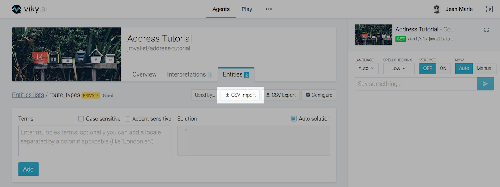

## Purpose

When your agent becomes more complex it will need lots of entities grouped within lists.
As such, it becomes easier to process those lists in an external tool and then import them into viky.ai.


## File format

### Overview

The file format is CSV (Comma-Separated Values) UTF-8 encoded. Both entities import and export use this format. It is composed of  3 comma-separated columns, where each line represents a complete entity.

The very first line of the file is the CSV header. It is mandatory and **have to** be:\
`Terms,Auto solution,Solution,Case Sensitive,Accent Sensitive`.

The first column contains terms grouped by meaning. A pipe character (`|`) is used to separate them.  The language for each term can be specified after a colon character (`:`). If this information is missing, the language for the term is considered as `no language`. At least **one** term is **required**.

The second column enables (or disables) the auto-solution option. This column **must** contain either `true` to enable or `false` to disable it.

The third column is the corresponding solution. If the `Auto solution` column contains `true` the solution content is replaced by the first term, if it is `false` the solution **must** be present as a valid JavaScript code.

The fourth column indicates if the terms are case sensitive. This column **must** contain either `true` if the term's case should be respected or `false` otherwise.

The last column indicates if the terms are accent sensitive. This column **must** contain either `true` if the term's accent should be respected or `false` otherwise.


### Examples

The first example is a simple CSV file with straightforward solutions:

```
Terms,Auto solution,Solution,Case Sensitive,Accent Sensitive
avenue,true, ,false,false
rue|street:en,true,rue,false,false
```

It will import two entities:

* line 1 is the mandatory CSV header.
* line 2 has only one term: `avenue` without any language. Since the `auto solution` is enabled, the `solution` column is ignored and it will automatically get the first term as a JSON string (in this case `avenue`). The term is neither case sensitive nor accent sensitive so both columns have the value false.
* line 3 has two terms: `rue` without any language and `street` with the english language. Again, since the `auto solution` is enabled the `solution` column is ignored even if there is a value and it will automatically get the first term as a JSON string (in this case `rue`). The terms are neither case sensitive nor accent sensitive so both columns have the value false.

The example below demonstrate a complex import:

```
Terms,Auto solution,Solution,Case Sensitive,Accent Sensitive
Paris,false,"{""city"": ""paris"", ""lat"": 48.866667, ""long"": 2.333333}",false,false
London:en|Londres:fr,false,"{""city"": ""london"", ""lat"": 51.514125, ""long"": -0.093689}",false,false
北京市:zh|Beijing|Pékin:fr,false,"{""city"": ""beijing"", ""lat"": 39.928889, ""long"": 116.388333}",false,true
```

<aside class="primary">
  <p>
    The whole JSON object must be enclosed in double quotes (<code>"</code>). A double quote must be escaped with another double quote.
  </p>
</aside>

It will import three entities:

* line 1 is the mandatory CSV header.
* line 2 has only one term: `Paris` without any language. Since the `auto solution` is disabled, the `solution` column is used. The term is neither case sensitive nor accent sensitive so both columns have the value false.
* line 3 has two terms: `London` with the english language and `Londres` with the french language. Since the `auto solution` is disabled, the `solution` column is used. The terms are neither case sensitive nor accent sensitive so both columns have the value false.
* line 4 has three terms: `北京市` with the chinese language, `Beijing` without any language and `Pékin` with the french language. Since the `auto solution` is disabled, the `solution` column is used. The terms are not case sensitive so the `Case Sensitive` column has the value false but the terms are accent sensitive, so the `Accent Sensitive` column has the value true.

In this example, every solution is a JSON object enclosed inside double quotes. It is composed of three fields, a city which describe what the term is about and additional information in the form of GPS latitude and longitude.

<aside class="warning">
  <p>
    Even though it is possible to customize every <code>solution</code> object within a list, it is strongly adviced to keep the same JSON format on every entity within that list. It will make the integration with third party systems easier when it comes to processing the interpretation's solution.
  </p>
</aside>


## Import entities

Select your agent, go to the entities list tab and open the list that will receive your data. Then click the "CSV Export" button in order to display the entities import form.



Only plain CSV files are accepted. An import can either append the file content to the list or replace it entirely. The line order in the file is preserved in the final entities list. Empty lines are ignored.

The import process can accept files with a size up to 30 MB.


There can be only one ongoing import at a time on a given entities list. A message will inform you that the import process is running. During this operation, manual updates are disabled.


When the import is finished, the interface will be automatically refreshed.


## Export entities

Select your agent, go to the entities list tab, and open the list you want to export. On the list header, click the "CSV Export" button.


viky.ai will offer you to download the corresponding CSV file. Its name has the following convention: `<username>_<agentname>_<entities_list_name>_<current_date>.csv`
