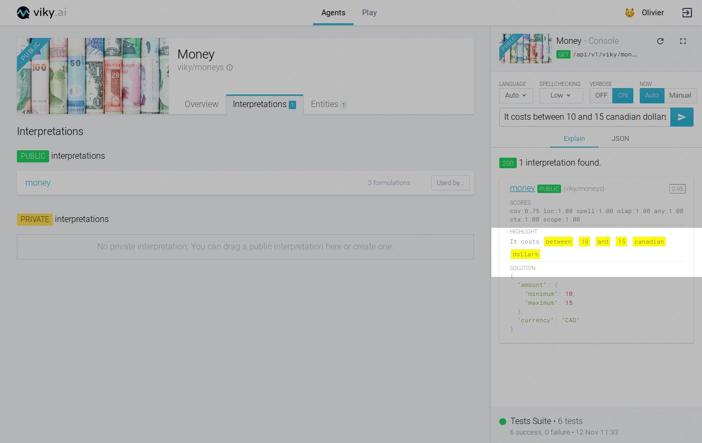
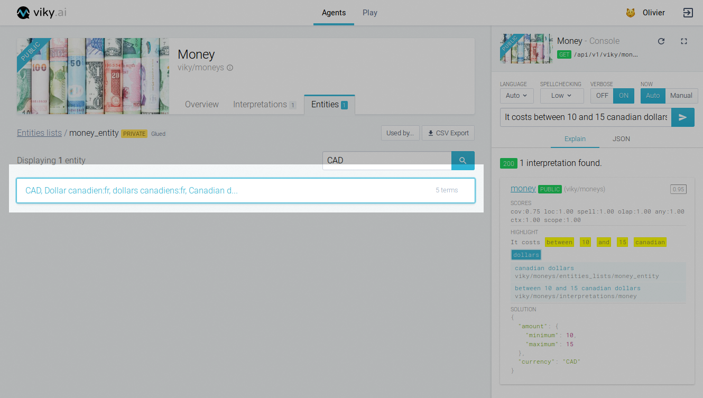

Sometimes an agent will not understand a sentence as you would expect. In this case, the functionality of the console panel allows you to explore in detail how your agent interprets each word.

## Display the interpret plan

Let us see how an [agent dedicated for currencies](https://www.viky.ai/agents/viky/moneys) in viky.ai interprets the sentence "It costs between 10 and 15 canadian dollars".

To explore, switch the "verbose" mode to `ON` and send your sentence. In the "Explain" tab, each interpretation will have a new "Highlight" section showing which words in the sentence correspond to the interpretation.

This section also allows you to see how the NLP has matched each word with the agent's interpretations and entity lists. Simply click on one of the highlighted words. Let us click on "dollars".

You will see a list of potentials interpretations and entities lists match for "dollars". If you look carefully, the list is sorted so that the top corresponds to the most accurate correspondence and goes down to the least accurate, ending with the entire sentence.

## Navigate

You can even navigate to interpretations or entities lists from that section. Click on the first item in the list, in our case the "money_entity" and the platform takes you to the exact entity within the clicked entities list that matched the word "dollars".

This gives you an idea how the agent breaks down your sentence and how to improve your formulations and entities lists if something is not behaving as you expect.

