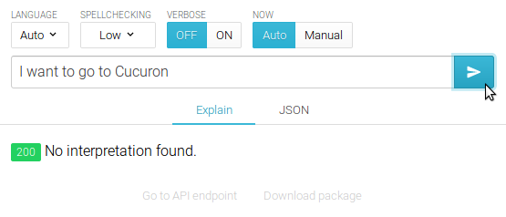
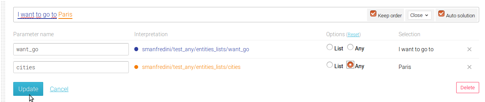
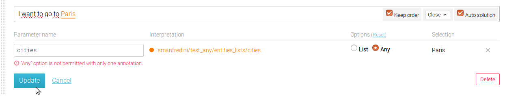

In some cases, it can be very interesting to match a word that is not known from the system thanks to the sentense structure around.
For example, in the sentence "I want to go to Cucuron for next summer"
Actually, Cururon is a small french town but very few people know it and your agent may not know it. But it can be recognized thanks to the sentence structure, knowing that what's following the words "I vant to go to" must be a place.
To do so, the word to be understood has to be annotated as "any"

## Basic Example

Let's create an agent **test_any**
Let's create in this agent a private entities list named **cities** containing only 3 french cities : **Paris**, **Lyon** and **Marseille**
Let's create in this agent a private entities list named **want_go** containing only 1 sentence : "I want to go to"
Let's create a public interpretation named **destination**organized as below

If, in the console, the sentence "I want to go to Paris" is typed, the returned city is "Paris"
If, in the console, the sentence "I want to go to Cucuron" is typed, the sentence is not recognized

To be able to recognize this unknown town, simply set the **any** annotation on, as below

Then, you can retry the sentence "I want to go to Cucuron", the sentence is correctly recognized.

## Restrictions

The use of the **any** annotation is very powerful, but it can also be dangerous because it can create false positive matches.
To avoid this, 2 controls have been integrated in viky.ai

The first one : an any annotation cannot be added when no other annotation is set in the formulation

The second one : Only 2 any can be taken into account for a sentence matching. With more than 2 any, the match will be considered as random, as it will introduce too much noise.
