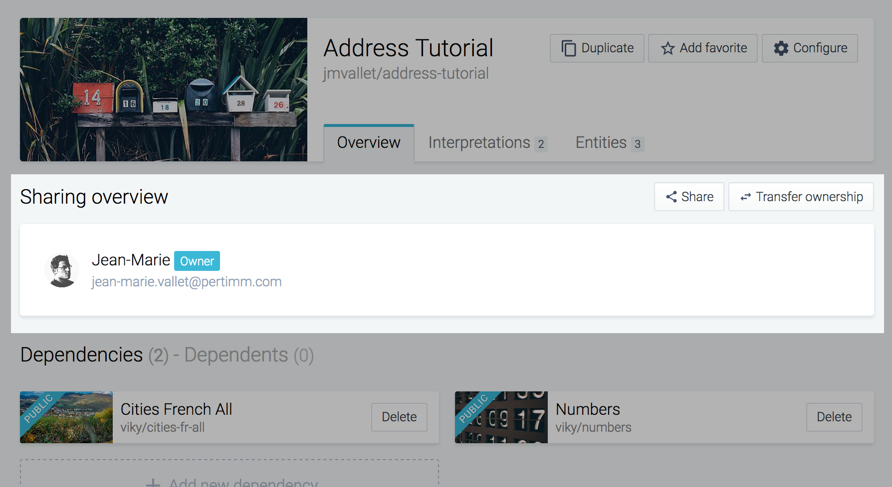
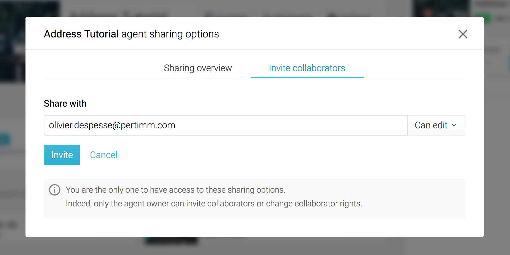
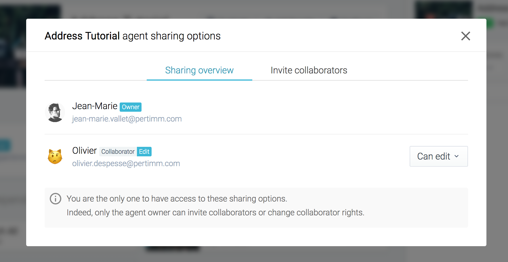
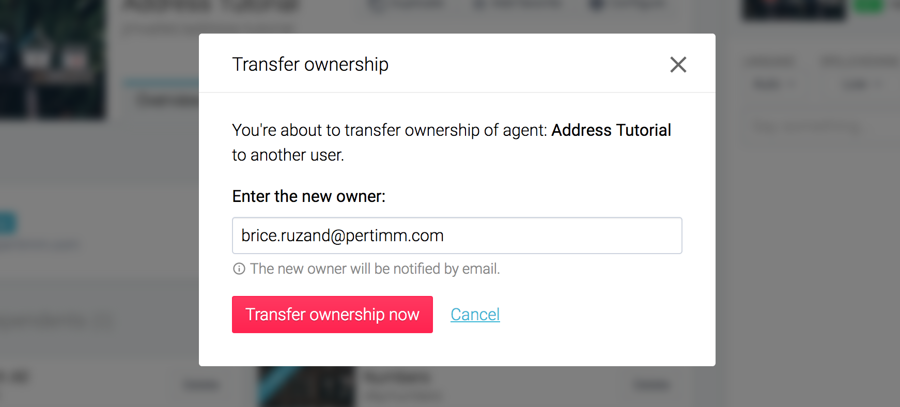
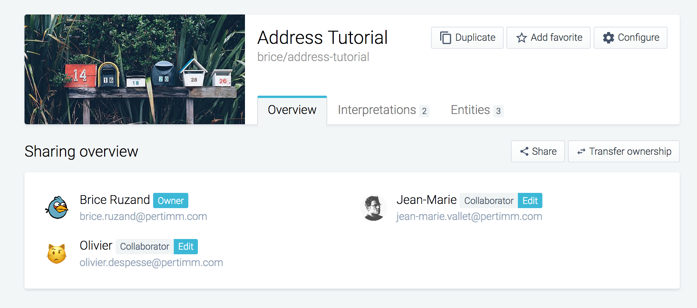

viky.ai allows you to work collaboratively on agents and thus benefit from the contributions of your collaborators. Here we explain how to proceed.

## Owner status

Let's start from the example described in the "[Getting started](../../tutorials/getting-started-part-1/)" tutorial when we created a new agent called "Address Tutorial". The user who has created an agent is the automatic owner of the agent.

You can check this by consulting the "Overview" tab of the agents, in the "Sharing overview" section.

The owner status of an agent allows you to view, modify, delete and invite people to collaborate with you on this agent. Let us look at this in detail now.

## Invite collaborators

Go to the "overview" page of an agent you own.

Here, you can share your agent with somebody else by clicking on the "Share" button, then:

<aside class="note">
  <h3>Note</h3>
  
A person must have an account on the platform to be invited.

</aside>

1. Click on the "Invite collaborators" tab in the modal window.
2. You can now invite someone to collaborate with you. Enter his username or email address to send your invitation.
3. Also select whether this person is allowed to only consult the agent or also to modify it.
4. Confirm by clicking on the "Invite" button.

The invited person will now receive an email indicating that they can collaborate on your agent.

The invited person now appears in the "Sharing overview" tab of the modal window. Here you can modify or revoke the access rights of collaborators (edit or show).

You can repeat this operation with as many persons as you want.

<aside class="primary">
  

    When an agent has a public visibility, defining collaborators with only "show" rights is not interesting. Indeed, public visibility gives reading access to all users of the platform.
  

</aside>

## Transfer ownership of your agent

An agent can only have one owner. However, as an owner, you can transfer ownership of your agent at any time. To do this, access the dedicated form by clicking on the "Transfer ownership" button.

Then enter the email address of the person who will define the owner of the agent. Confirm by clicking on the "Transfer ownership now" button.

There you go! :sparkles: You are no longer the owner of the agent, but you remain a collaborator with edit rights.

The new owner now has the choice of whether or not to keep you as a collaborator. :blush:

<aside class="warning">
  

    In case you no longer wish to use viky.ai and some of your agents are used by others, please transfers ownership rather than delete your agents.  This is to avoid disturbing the agents who use yours.
  

</aside>
