When analyzing sentences in different languages it is often possible to find common patterns on how the idea is expressed. In viky.ai, agents are multi-lingual. It allows you to harness the power to factor these common models together.


## Configure your agent

The agent will be able to interpret sentences like "Pour the flour" or "Break the eggs" in English and French.

First we need to create the agent. In the settings panel you can choose which languages it will be able to understand. Name it "Home cooking" and check "No language" and "en (English)".

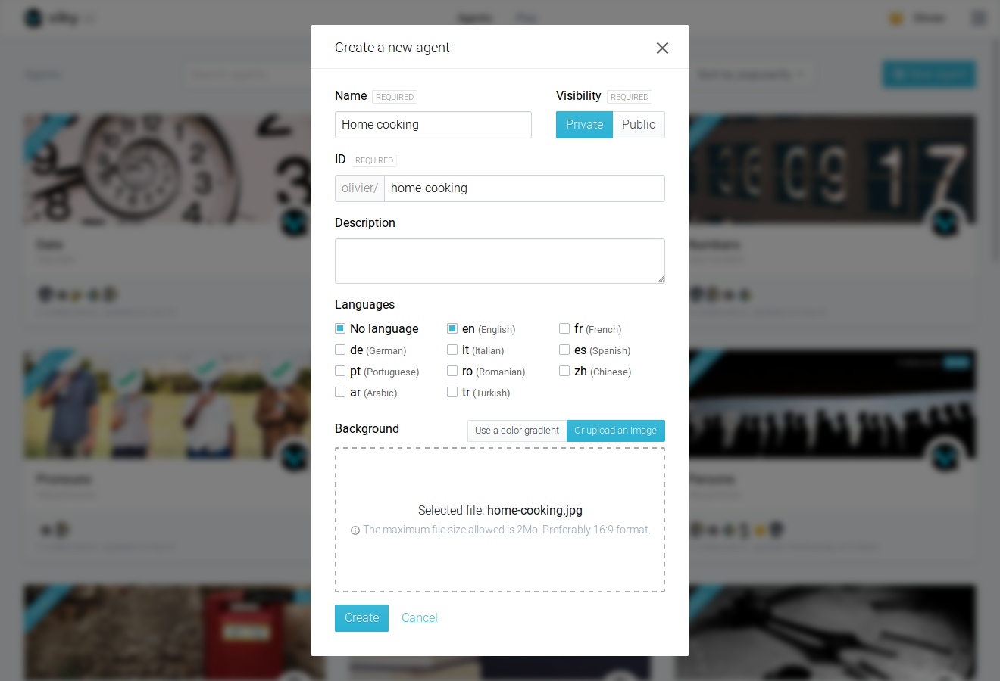

<aside class="note">
  <h3>Note</h3>
  <p>
  viky.ai support many languages: English, French, German, Italian, Spanish, Portuguese, Romanian, Chinese, Arabic and Turkish.
  </p>
</aside>

Create a public interpretation named `recipe_step` and open it. Notice three tabs at the top, one for "No language", another for the English language and the last one with a "+" sign. Click on it to show the "Add language" menu, then click on "fr (French)" to add this language to the agent.

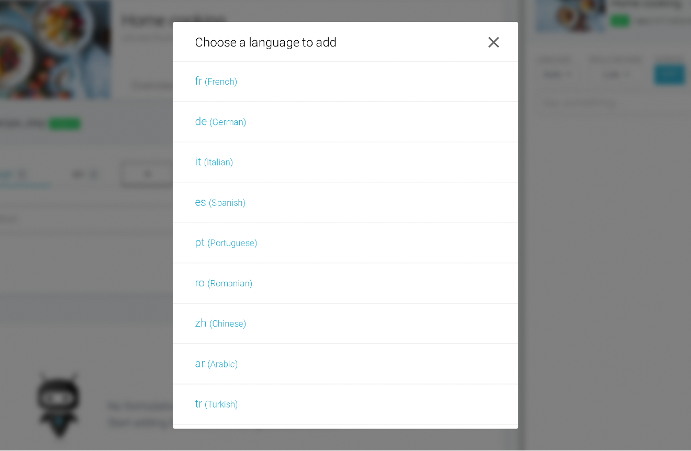


## Multilingual agent

Start by adding two formulations `Pour the flour` under the English tab and `Versez la farine` under the French tab. Try these two sentences in the console.

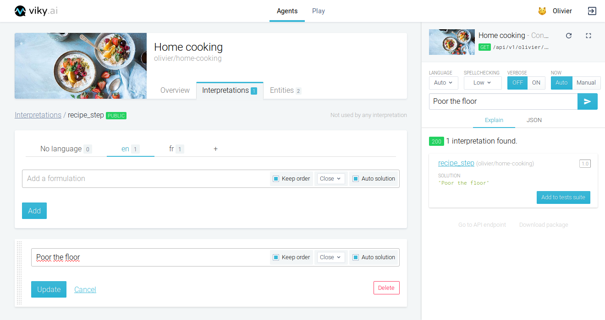

Of course they perfectly match! The annoying part is that everything is duplicated for every language. We can do better! As you build more agents, you will see that the language dependent part can be quite limited. It is possible to factorize together the common syntactic pattern and leave language specifics words in dedicated entities lists. We are going to do exactly that.

Create two entities lists, one called `food` and the second called `instructions`. In "food" add this entity:
```
flour
farine
```

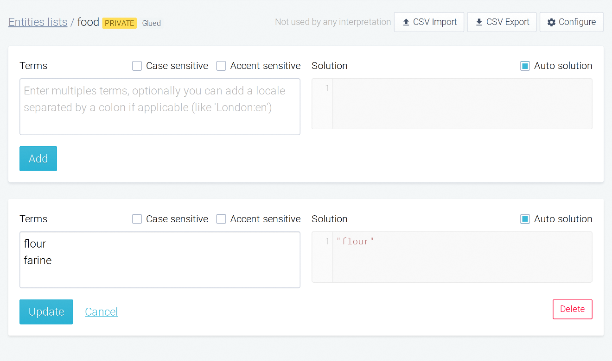

In "instructions" add two entities:
```
Pour
Versez
```
and
```
Break
Cassez
```

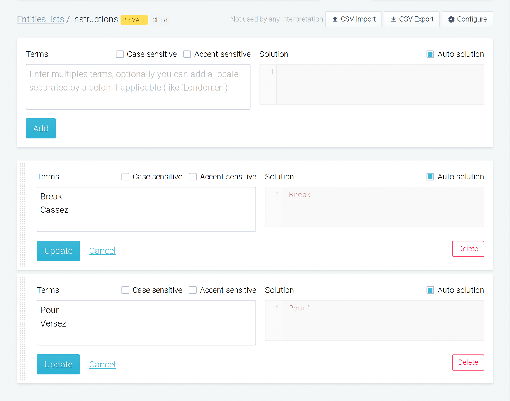

<aside class="note">
  <h3>Note</h3>
  <p>
    It is possible to drag and drop an interpretation from a language tag to another language tag, which is a very cool feature !
  </p>
</aside>

Now, annotate both formulations with entities lists. Notice that in English and in French those two annotations uses the same pattern, namely an instruction followed by a food. It does not depend on any natural language anymore. In order to avoid this duplication we can recreate such formulation in the "No language" tab and delete the English and French formulations. This tab is the place to put formulations describing the common patterns between languages.

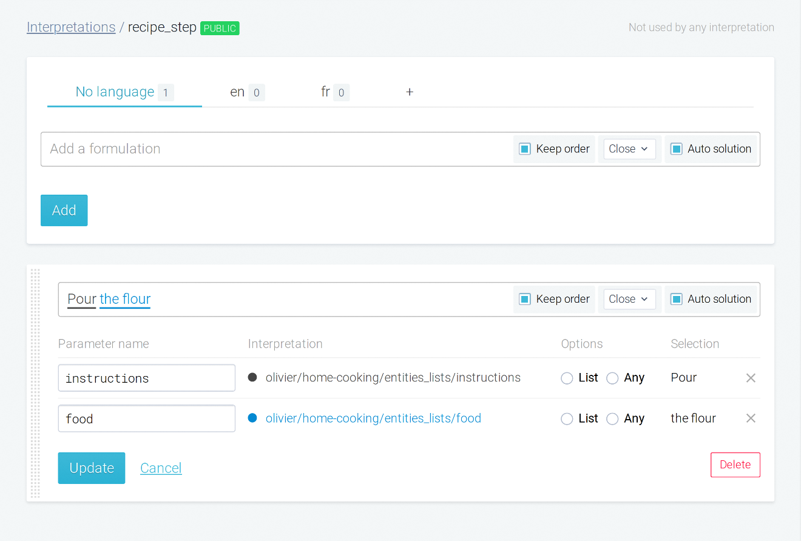

If you want to add another language, simply add expressions in the corresponding entities lists.

In this example, we are lucky enough to remove all languages dependencies in a single level, but sometimes it takes more interpretations indirections to reduce the dependency. However, one or two levels are usually enough.

Whether you want to create a monolingual or multilingual agent, you should apply the following principles:

* create entities with the right language: when a word come from a given language, say so!
* add the interpretation's words in the corresponding language tab,
* when your interpretation does not depend on any language, add it in the "No language" tab.


## Words variations

Words in a language are found with many variations such as plurals, verbs, adjectives, etc. In order to extend the language support of our formulations, we can use the automatic lemmatization present in viky.ai.

<aside class="warning">
  <p>
    As of now, only English and French lemmatizations are implemented.
  </p>
</aside>

For instance, if we try the sentence "Pouring the flour" no interpretation is found because our current agent is not able to handle such variation.

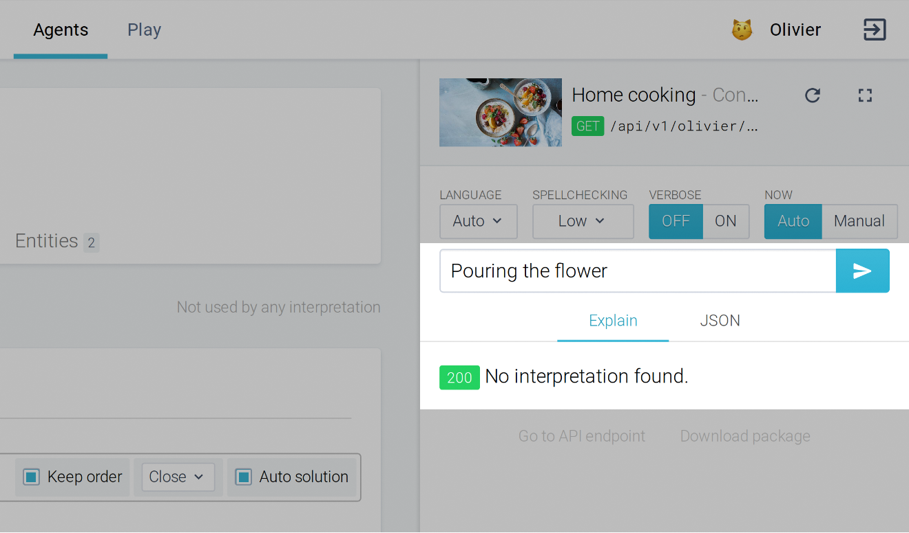

To apply lemmatization to a word, use the following rules:

* specify the language,
* use singular for nouns and adjectives,
* use infinitive for verbs.

This means that in our entities list "instructions" we must change several things. First we must specify the corresponding language of each terms by adding the language ISO-639 norm encoding separated by a colon ":" character. Second we must change our terms to be in the infinitive forms. It is already the case for the English version but not for the French one.

```
Pour:en
Verser:fr
```
and
```
Break:en
Casser:fr
```


If we try again the previous sentence "Pouring the flour" now it match even if we do not have it explicitly in the entities list!

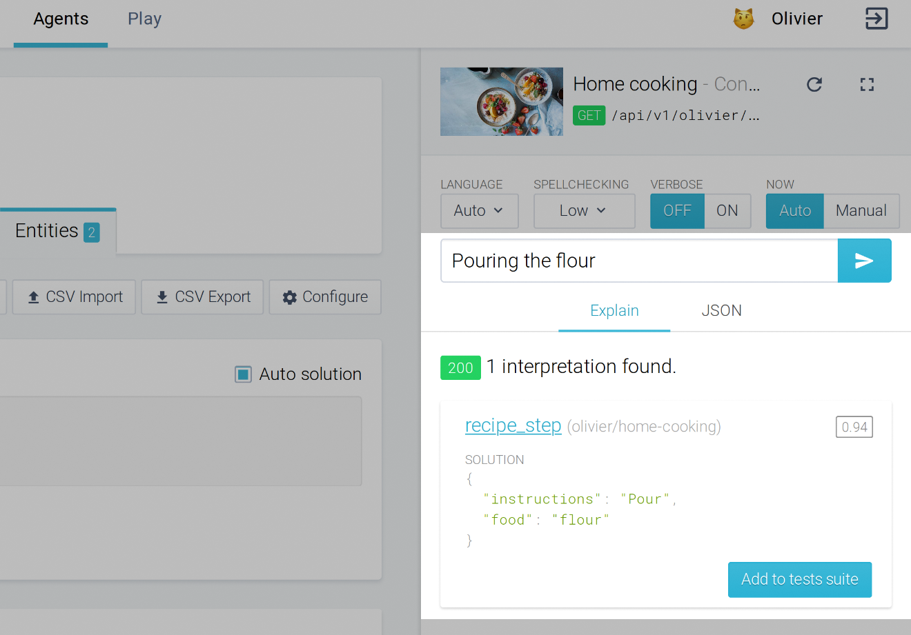


## NLP request and language

Most of the time we do not need to specify what is the expected language. It is left to the NLP to match the submitted sentence against the most likely interpretation.

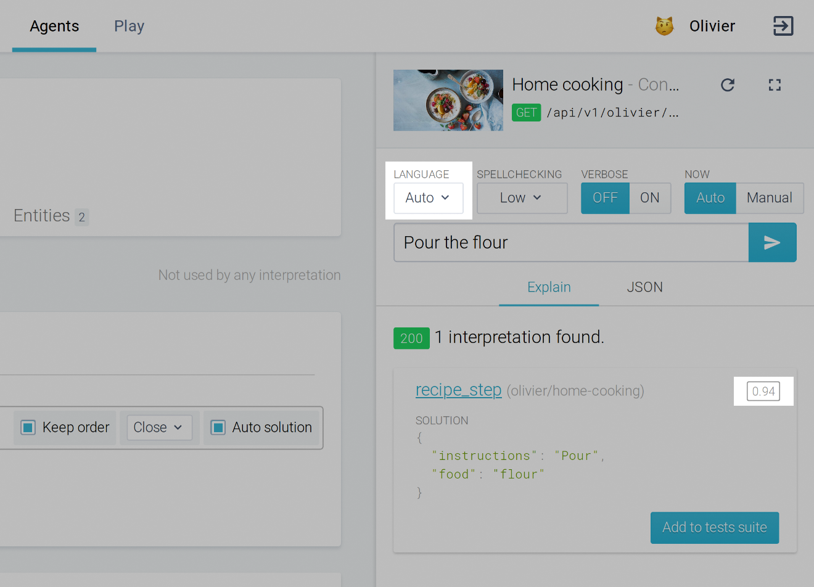

It is also possible to specify one or several languages using the "Accept-Language" parameter. In that case, all languages are accepted, but the specified language is privileged.


This means that even if you specify "en" as the only accepted language, it will still understand all other languages.


## The universal language


In our day-to-day life we often use more than words to communicate, we use emojis :grinning:!

In the "food" entities list, create a new entity for eggs in English, French and emoji (no language):

```javascript
egg:en
oeuf:fr
🥚
```

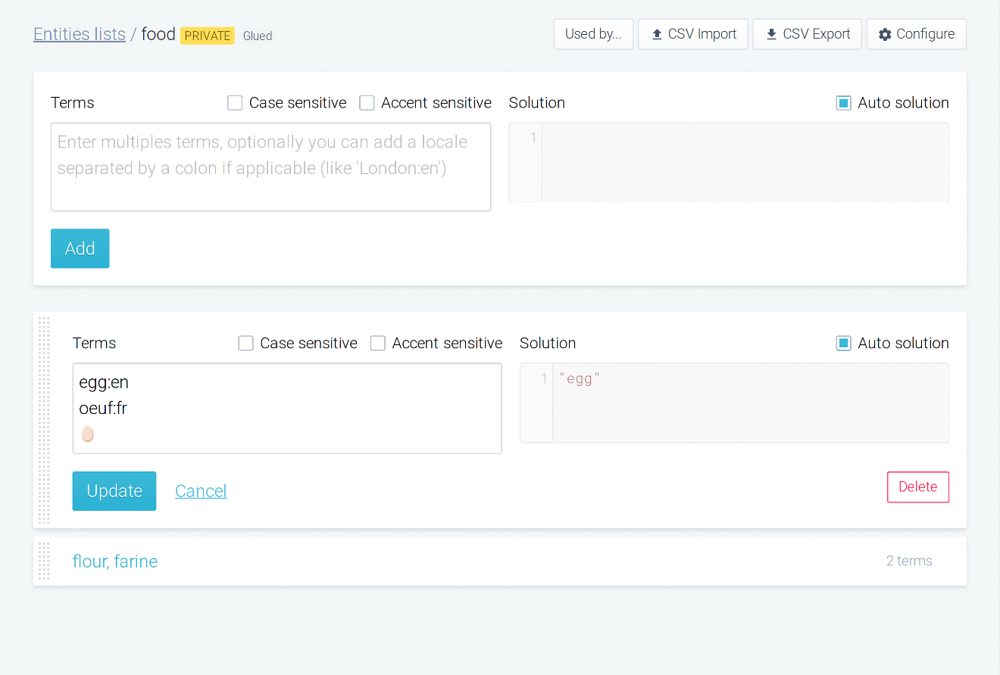

Now if you type the sentence "Break the 🥚" we have a match!

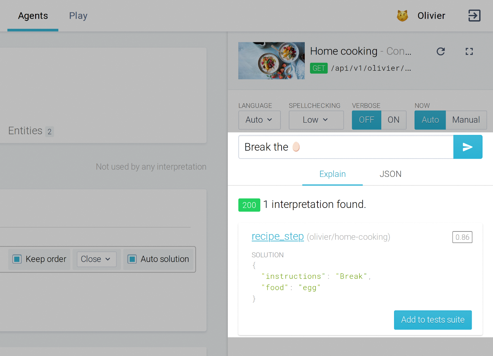
