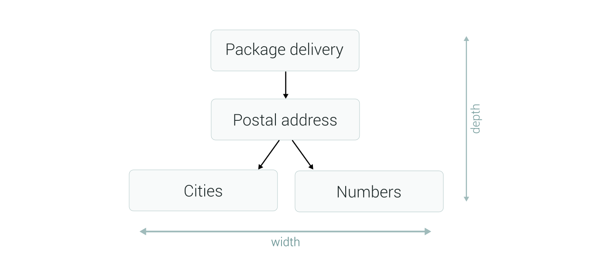

Understanding unstructured texts expressed in natural language is a complex subject that has been the subject of active research and development for years.

A major difficulty is the connotation that people introduce into their daily communications such as idioms, humour (irony, sarcasm...) or metaphor, to name a few. This creates an ambiguity that only a human being is able to understand through the context of the conversation.

A computer on the other hand is completely oblivious to such context. As a consequence, a good solution is to delimit a clear scope that defines what and how sentences are analyzed. In viky.ai this is called an agent.

## What is an agent?

When we define a set of sentences that we want to understand, they usually imply some business requirements that create an implicit context. This means several sentences refer to a common subjects or are related in one way or another.

For instance, in the context of movies, sentences like "What film won the best picture Oscar in 2010?", "I want to watch a spy movie." or "Who directed Pulp Fiction?" all convey the idea of finding movies according to different criteria. Even if they do not express exactly the same intention we can still group them together.

This is where the agent come into play. It is the entry point for you to build and manage the analyzing process. It provides many features:

* Define a set of rules to analyses sentences.
* Submit new sentences to interpret.
* Reuse other agents as dependencies.
* Maintain a consistent interpretation quality over time.
* Manage access rights between collaborators.

And we can add the corollary descriptions:

* Your agent is done within the viky.ai platform and is then run by the platform.
* The analysis or the form that you want is the semantic structure that you will decide your agent will create.

Agent's rules are so flexible that you can analyze the texts of any subject. In fact, the the purpose of the agent is first defined by the type of text you want to analyze. Do you want to understand postal addresses in letters? Do you want to extract emotions in a text? Do you want to analyse questions in a chatbot?

Such flexibility is the key to help you structure your agent. Chances are you will end up with a collection of agents, each one dedicated to a specific task. They can easily be superimposed from a narrow use case at the bottom to a wider and more abstract case at the top. For instance with three agents you can have a first agent dedicated to find numbers, use it in a second one to find references to money and which is used in a third one to understand sentences about financial data.

This strategy of composition is at the heart of viky.ai and we are going to detail it in the next section.

## Organize agents together

Agents are the fundamental elements of text understanding. You can shape them to interpret any content, from mundane ideas to abstract concepts.
You may be tempted at first to include every sentence you need into one single big agent. This is usually a bad idea. The inclusion of too many focus subjects in the same agent confuses the scope of what the agent is supposed to understand.

The proper way to handle such case is to split your big agent into several smaller ones. Each of those focus on a specific subject, it should be short and to the point. A general rule of thumbs is to follow the single responsibility principle stating that an agent should have only one reason to change. Basically an agent about the weather is only updated if you want to match new sentences about the weather forecast and not for sentences about flights booking for instance.

Relying solely on small agents won't get you very far to solve real life business issues. This is where you need composition. An agent is able to include an arbitrary number of other agents and exploit their results to produce a new outcome. This forms a tree of dependencies between agents without limit of depth nor width.

There is two ways to use this dependencies tree. The first one is by depth. At the bottom we have agents for practical ideas like numbers, date, length units, cities, etc. On top of that comes agents for slightly more elaborated concepts. For instance with "Numbers" and "Cities" we can create a new agent "Postal address" that depends on the first two for those details and tie them with the missing concept of address. Again, we can add a third higher level where the Postal address becomes a dependency of a "Package delivery" agent. We can repeat this process as much as we want. In the end, the root agent in this tree is the entry point for the text analyzing process and it describes the most abstract level of understanding.

The other way to exploit the dependencies tree is by width. Agents can be assembled when they are about subjects that complement each other. For instance if we need to understand the order "I want to watch a spy movie." we just need two agents. One to understand orders in the form of "I want to watch" and a second to understand movies categories, here "a spy movie". Those two dependencies are siblings in the dependency tree.

Even by reusing agents, fully covering your use case requires some efforts and a lot of time. A core feature of viky.ai is the ability to collaborate between users. Let's see how it works.

## Collaborate to an agent

When you tackle a large project covering a wide variety of sentences with convoluted syntax, it involves a lot of work even when reusing dependencies. In this case viky.ai allows you to invite users to collaborate at creating agents.

Collaboration is configured by user and by agent, meaning you have total control of who sees what of your workspace.

Once you have found a potential collaborator, viky.ai sends a notification to inform him of his new status. Depending on the access rights you have set up, the collaborator can either just navigate through the agent or also edit it.
The navigation is useful when asking feedback to someone about your current work. It is also a convenient way to authorize particular users to integrate your agent in their own projects.
Giving an edition access is similar to the navigation with the added right to update the agent content.
Either way you remain the agent's owner, which means that you are the only one able to change the agent's configuration and to manage access rights (including revocation) at anytime.

One great way to collaborate is to contribute back to the viky.ai community by giving away freely part of your work. For this, make your agent public.

## Make it public

When looking for dependencies you may notice that you have access to a lot of existing agents from other users. Beside your own and those for which you are a collaborator, they all have in common to be identified as "public".

By default everything you do in your viky.ai account is private and only visible to you. Still, each agent has a visibility setting allowing you to make it available as a read-only to everyone on the platform.

Sometimes when working on your agent you may find useful to factorize a sub-part in its own dedicated agent about a small area of understanding. While doing such split you may evaluate that this new small agent could be useful to other users too. This is where you may choose to contribute to the viky.ai community by giving away your agent and publishing it as public. Imagine you are working on a chatbot to help your customer buy clothes with a color criteria. Splitting your agent between the "buy cloth" and the "color" recognition is good idea. Since finding colors in sentences is pretty common it is a good candidate to release it as public.

Ideally a public agent should be as generic and universal as possible on its area of expertise. Any agents, especially those public, should follow some good practices that we explain in the next section.

## Last advices

Now you know everything about agents, what it is and how to use it. But you may still wonder how can I create a useful agent? Am I implementing a lasting design?

To help you, as general guidelines, your agents should have those properties:

* **Completeness**: your agent should cover its area of understanding as extensively as possible.
* **Consistency**: your agent's semantic solutions must have a structure that consistently represents the result of the text analysis.
* **Descriptive**: as the semantic solution of your agent really represent an idea, it should describe it the same way for any language.
* **Multilingual**: as you are representing ideas taken from text, your agent should normally be multilingual. Even if at first it is monolingual, it should not be difficult to add another language to your agent to express the same idea.
