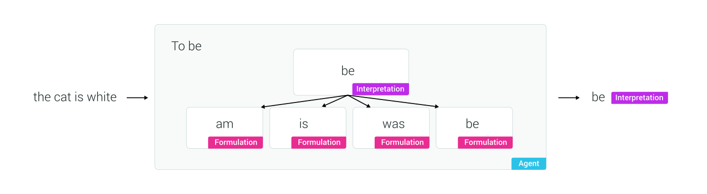
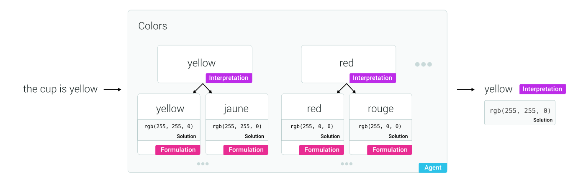
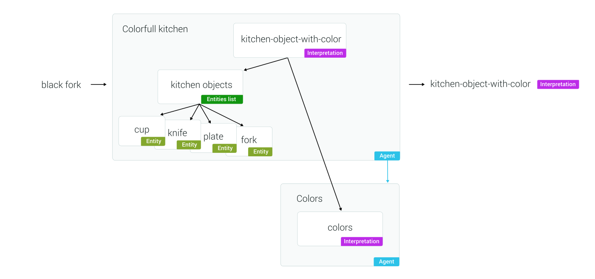
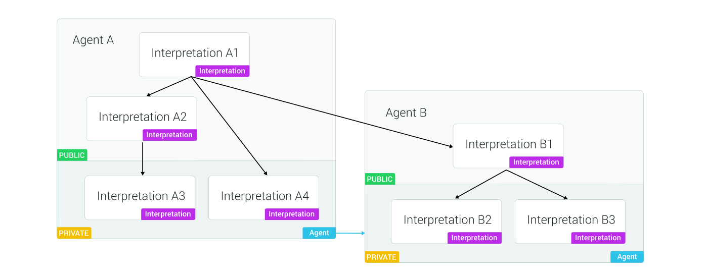

We discuss here the main concepts behind viky.ai. If the terms "NLP", "semantic solution", "agent", "interpretation", "formulation", "entity" do not mean anything to you, this is completely normal. We hope that reading this documentation will help you to clarify these terms, in order to understand viky.ai.

## NLP

NLP means Natural Language Processing. You can look up this dedicated [Wikipedia page](https://en.wikipedia.org/wiki/Natural_language_processing). viky.ai is indeed a Natural Language Processing platform as it helps you analyze natural language texts. But what does exactly "natural language texts" mean in essence?

A natural language text is a text written in English, German, French, or any human language, as opposed to artificial languages, such as programming languages.

## Text analysis and semantic solution

What do we want when we analyze a text? Well, it depends really on what is our goal. For example, with the following sentence:

> In november 2019, Google bought Fitbit for $2.1 billion.

* we might want to extract only dates or money amounts,
* or we might want to extract company names,
* or we might want to get information about companies buying other companies.

**The result of the analysis** will then be very different. This **is what we call a semantic solution**.

viky.ai's goal is to help you create text analysis processes that will provide you with semantic solutions. We call such text analysis processes an agent.

## Agents

**Agents are processes that analyze a text and provide you with a semantic solution** for this text (or several semantic solutions in some cases).

Let's take a simple example: with the expression "twenty-three", we would like the agent to get the number 23. In essence you have transformed a text into a value that can be further processed by a computer.

In this example, you can achieve independence from the natural language, as you can get the same result with "vingt-trois" (French), or any other natural language expression of a number.

Now we will further describe the concepts used to build agents.

## Interpretations and formulations

**Interpretations are the building blocks of agents**. They can be combined and nested resulting in a new interpretation.

**An agent is a set of at least one or more interpretations that can be combined together.**

**An interpretation is defined as a list of formulations**, those formulations are the **different ways of expressing the interpretation**.

For example, we can build an interpretation that will represent different ways of expressing the verb "to be" (here, only a sample):

* am
* is
* was
* be

In that case, the `be` interpretation is made of the "am", "is", "was" and "be" formulations.

So, if we submit the text "the cat is white" to a "To be" agent, it will return the `be` interpretation. In that case, it will have recognized only the word "is" in the sentence.

## Formulations and semantic solutions

Most of the time, **we want to standardize the agent's analysis**: we know which interpretation the agent has found, but we want to translate it **into a processable format**.

For example, if we have an agent "Colors" that recognizes colors, we would like to get the RGB code of the color, and not only the fact that it is a color.

For this, we can create an interpretation for each color and create a formulation for each way this color is expressed. Let's say we create the "yellow" interpretation, it will have a "yellow" formulation and a "jaune" formulation (French for yellow), and we will attach the semantic solution `rgb(255, 255, 0)` which is the RBG code of this color.

Thus if the text is "the cup is yellow", the Colors agent will return the following **semantic solution**: `rgb(255, 255, 0)`.

<aside class="primary">
  

    In viky.ai we often abbreviate <strong>semantic solution</strong> into <strong>solution</strong>.
  

</aside>

## Entities

**Entities**, which are also called **named entities**, **are real-world objects that can be identified by their name**. In the context of a sentence, entities defines what this sentence is about without ambiguity.

For instance, in the context of a political article, "Emmanuel Macron" refers to the french president. You can see that somehow the name "Emmanuel Macron" can be a formulation and "French president" can be a semantic solution. Those specific interpretations are called entities because they describe mostly a word and not the sentence's structure.

Entities list, are usually large lists of words or expressions with semantics solutions attached to them. Those lists could contains thousands of items, so in most cases we want to massively import entities with their corresponding solutions from an external source reference.

## Combining interpretations

**Interpretations can be combined together**. This combination mechanism is the cement that joins the bricks which are the agents. It creates a tree of dependencies between them allowing to reuse interpretations commonly found in natural language.

Those combinations are closely tied to the structure of the text which the interpretation will analyze. Let's say we have an agent with an entities list containing a list of kitchen objects such as a "cup", "knife", "plate", "fork", etc. and an other agent exposing an interpretation matching every color.

If we want to analyze the sentence "a red cup", we would create an interpretation with a formulation shaping the sentence's structure of a "color" followed by an "object". We would say that "red" match the interpretation of the Colors agent and "cup" match our entities list of kitchen objects. This interpretation's structure being universal we will be able to understand all the combination between a color and a kitchen object, such as "black fork", etc.

Thus we can see that with one single combination, we can achieve the analysis of many possible sentences. This combinatorial power is the reflection of the combinatorial nature of the human language.

<aside class="primary">
  

    When we have thus created a combination, there is another mechanism that can also combine the solutions coming from the two <strong>sub-interpretations</strong> into another more complex semantic solution.
  

</aside>

## Combining agents

Agents have two types of interpretations:

* **public interpretations**, which can be used by any other **agents** just like an interface with the rest of the world
* **private interpretations**, which are used only within the **agent** to keep things organized internally

Thus, to combine two agents together, it is only necessary to combine a public interpretation of an agent within any interpretation of the other agent whether private or public.

## Independence from the natural languages

A good property we want to achieve is that the semantic solution does not contain information depending on natural languages. It is not mandatory, and in some case, it can even be good to have words from the text into the solution, but usually this independence is still a good property to achieve.

In our example with the text "twenty-three", we obviously obtain that property when the solution is the number "23".

In other cases such as the kitchen objects, we could attach to each object a string that is independent from the language and that represents the object. For example "tasse" (French) and "cup" (English) will both have a solution "#cup" for example, that will represent the concept of a cup.
