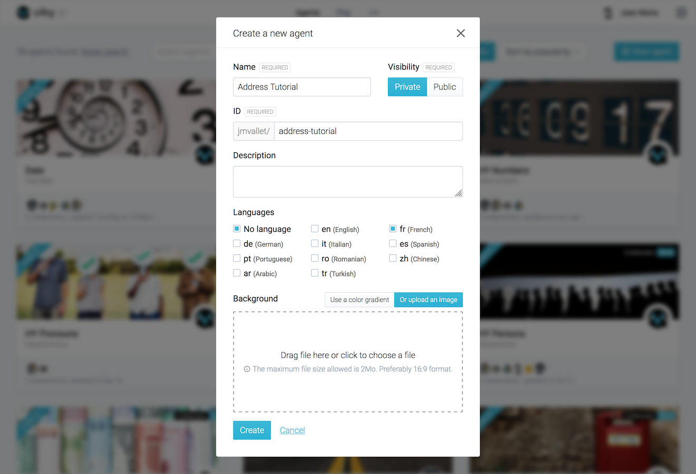

## Purpose

This guide will help you get started with viky.ai. We will guide you to create your first agent to structure information from contents and to retrieve relevant information in these contents by interacting with your data in natural language.

We will demonstrate different capabilities of viky.ai through a very simple use case:

- You have some contents where you want to retrieve the postal address to create some metadata, for instance to classify the information.
- Furthermore, you have customers who want to query these contents by searching with a postal address. Queries should be in natural language to facilitate the interactions.

In practice, you will create an agent allowing you to send a text to the [viky.ai Agents API](../../api/agents/) and it will extract the French postal addresses in a structured way.

## Best practices to start

**Defining the scope and usage is your first priority before starting** any new project in viky.ai. It will help you create the most appropriate design for your agents.

### What is a postal address?

- A _postal address_ usually contains a route, a street number, a postal code, and a locality.
- It could also contain additional information about the floor, the apartment, the building.
- It would be interesting to have the GPS coordinates of the locality, to use on a map, for instance.

_Postal addresses_ could be slightly different from one country to another. So let's start this tutorial with French postal address!

A typical example is: _12 avenue de Flandres 75019 Paris_ (find some information about postal addresses on [Wikipedia](https://en.wikipedia.org/wiki/Address#France)).

### Can I reuse components or should I create everything from scratch?

Think about the elementary components you will need to create agents that are able to identify a postal address.

In the example "12 avenue de Flandres 75019 Paris", the decomposition into elementary components gives:

<aside class="note">
  <h3>Tips and tricks</h3>
  

    Open resources exist on the web to facilitate the creation of these elements.
  

  

    For instance, route types are available on <a href="https://fr.wikipedia.org/wiki/Odonymie_en_France#Types_de_voie">Wikipedia</a> or on this <a href="https://gist.github.com/384400/bf3c83a4e7d1aa66a87e">GitHub Gist</a>.
  

</aside>

- `12`: Street number
- `avenue`: Route type
- `de Flandres`: Route name
- `75019`: Postal code (i.e. a specific pattern of numbers)
- `Paris`: Locality

Optionally, it could contain information about the apartment, building, floor.

viky.ai already contains some generic agents - numbers and French cities - to help you in this creation.

We will create a module (named *Agents* in viky.ai's world) able to identify each part of the address, and a postal address.

## Create an agent

Login to viky.ai. You will see an interface listing the available agents. Click on the **New Agent** button.

A modal box with the form "Create a new agent" opens.

<aside class="note">
  <h3>Tips and tricks</h3>
  

    <code>ID</code> must be URL compatible. Use unaccented, lowercase characters and separate the words with a dash (<code>-</code>).
  

</aside>

1. Fill the `Name` field with "Address Tutorial".
2. Set the `Visibility` to `Private`, so that you will be the only user to see this agent.
3. Fill the `ID` field with "address-tutorial".
4. Check the following options for languages: `No language`, `fr (french)` and uncheck `en (english)`.
5. Choose a background color or upload an image.
6. Submit the form with the **Create** button.

The agent is now created. By default, you land on the **Overview** tab of the agent.

On the left part of the UI, you can edit agent's configuration, manage access rights, dependencies and add a Readme to describe your agent. On the right part, a console allows you to play with the agent, but we will come back to it later.

<aside class="primary">
  

    You can add a <strong>Readme</strong> in this <strong>Overview</strong> section. This is particularly useful to describe the purpose of your agent, and add some examples of what it will be able to do. For this tutorial, copy and paste the purpose of the tutorial in the <strong>Readme</strong> section. Add the following examples of French postal addresses as an illustration (it will also serve as unitary tests during the agent creation). Examples should be as representative as possible.
  

  <ul>
    <li>12 avenue de Flandres 75019 Paris</li>
    <li>108 rue Jean Moulin 54230 Neuves-Maisons</li>
    <li>240 Impasse du Fief du Breil 44690 La Haie-Fouassière</li>
    <li>3 Passage Pommeraye 44000 Nantes</li>
    <li>1 Rue de la Miséricorde 20200 Bastia</li>
  </ul>
</aside>
