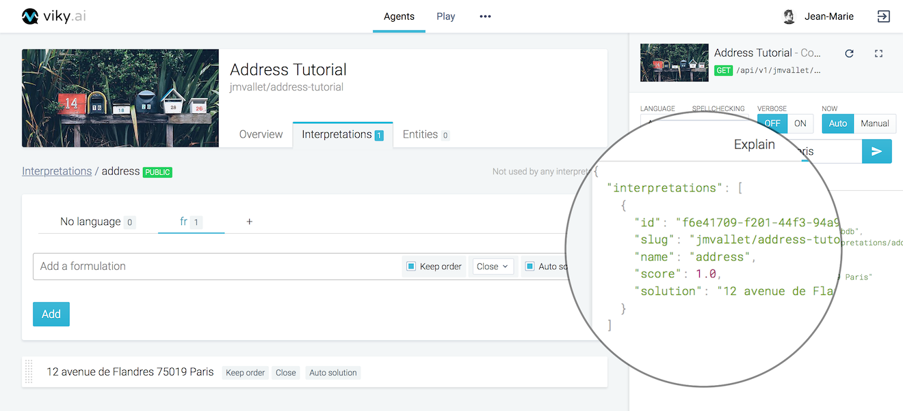
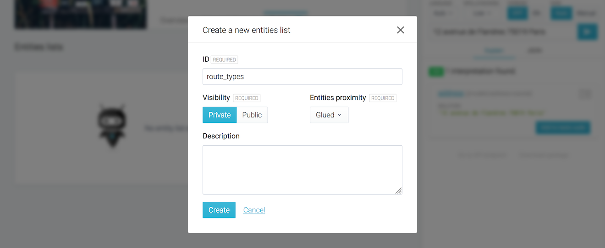
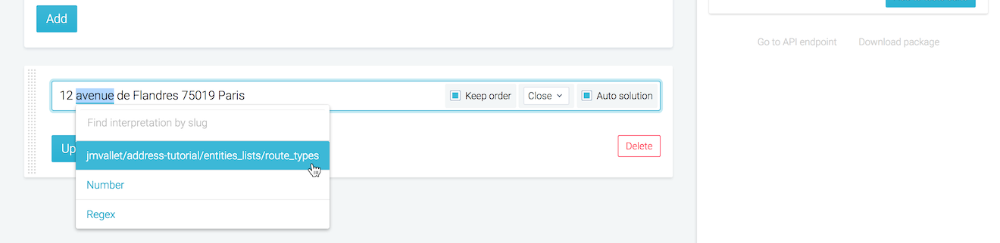

This tutorial begins where [Getting started - Part 1](../getting-started-part-1/) left off. You'll create your first interpretation, some entities and use the console.

## First basic interpretation

### Create an interpretation

In the **Interpretations** tab, click on the **New Interpretation** button.

<aside class="note">
  <h3>Interpretation visibility</h3>
  <ul>
    <li>Public interpretations are those exposed by the agent; they provide final solutions.</li>
    <li>Private interpretations are used to perform intermediate calculations or computations.</li>
  </ul>
</aside>

A modal box with the form “Create a new interpretation” opens.

1. Fill the `ID` with "address".
2. Set your interpretation visibility to **Public**.
3. Fill a description: "Identifies the French postal addresses."
3. Click on the **Create** button.

### Create your first formulation

Your first interpretation is created. Now click on it and select the **fr** tab. Type "12 avenue de Flandres 75019 Paris" in the text area, then click on **Add**.

Keep the default options (_keep order_, _close_, _auto solution_) as is. We will come back to them later.

### Testing the agent

A console panel is on the right to test in live your agent. Type "12 avenue de Flandres 75019 Paris" in the text field and click on the arrow to send the request. This console calls your agent by REST API.

You can see the returned solution in the **Explain** tab (opened by default). The solution is also available in JSON format; click on the **JSON** tab to see it.

The returned value is the interpretation you just created and the score is the match confidence level: 0 means no match, and 1 means an exact match. Here the score is 1 because the sentence typed in the console exactly matches the formulation you just created.

<aside class="primary">
  

    The <strong>Console</strong> has multiple usages. It could be a place to realize your <strong>manual unit tests</strong>, validate an interpretation each time you create a new one.
  

  

    It also allows to save your tests to create an <strong>automated tests suite</strong>. A best practice to have in an NLP project is to have continuous improvements with a view of potential regressions.
  

</aside>

## Route types

You want to be able to identify any _French postal address_ with other street number, route types and names, and localities.

We will start with the route types detection by using an entities list.

### Create a route type entities list

Click on the **Entities** tab and click on the **New entities list** button.

<aside class="note">
  <h3>Naming conventions</h3>
  <ul>
    <li>Names are always in English.</li>
    <li>Favor the singular form to name an interpretation.</li>
    <li>Favor plural form to name an entities list.</li>
  </ul>
</aside>

A modal box with the form "Create a new entities list" opens.

1. Type "route_types" in the `ID` text field.
2. Select **Private** and **Glued** options.
3. Click on the **Create** button.

Click on the entities list you just created to open it and enter route types names:

1. Type "rue" in the **Terms** text area ; then click on **Add**,
2. Type "avenue" in the **Terms** text area; then click on **Add**,
3. Type "impasse" in the **Terms** text area; then click on **Add**,
4. Type "passage" in the **Terms** text area; then click on **Add**,

<aside class="primary">
  

    It is also possible to import long lists of entities into viky.ai with a CSV file.
  

</aside>

### Link entities list to interpretations

Go back to the **Interpretations** tab, click on the **address** public interpretation.

Step 1 <strong>Edit the current formulation in address interpretation</strong>

Click on the formulation "12 avenue de Flandres 75019 Paris" in order to edit it.

Step 2 <strong>Link avenue with route_types entities list</strong>

1. Highlight **avenue** in "12 avenue de Flandres 75019 Paris".
2. A drop-down list appears displaying the different interpretations and entities lists available.
3. Choose the **route_types** entities list (it should be labeled like `yourname/youragent/entities_lists/route_types`).
4. Click on **Update**

Step 3 <strong>Validate</strong>

Test in console the interpretation with the following sentences:

- 12 impasse de Flandres 75019 Paris
- 12 avenue de Flandres 75019 Paris
- 12 rue de Flandres 75019 Paris

All sentences are successful, the interpretation **address** is found on each route type variant.

