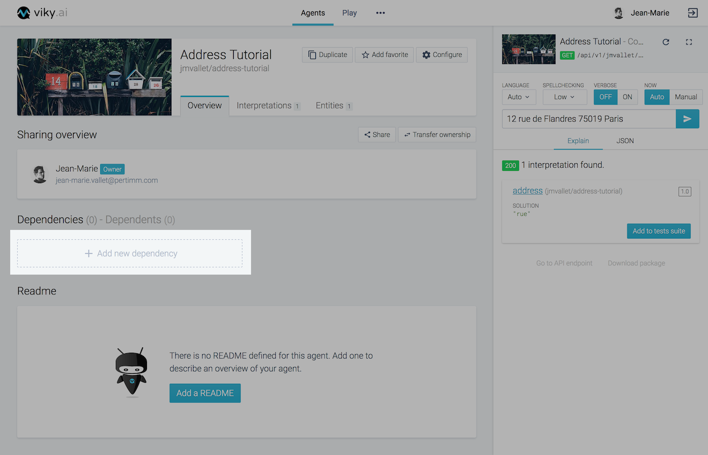
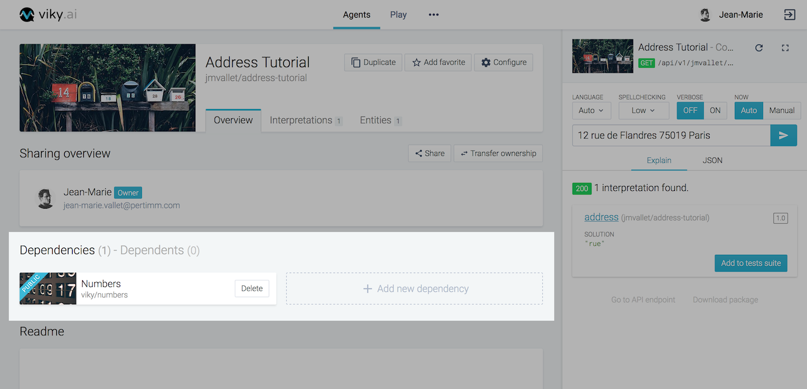
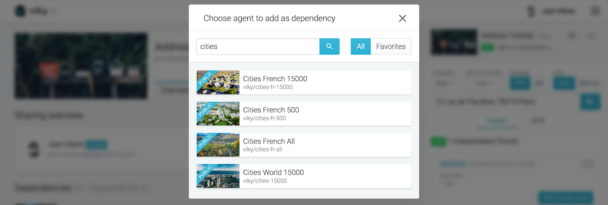
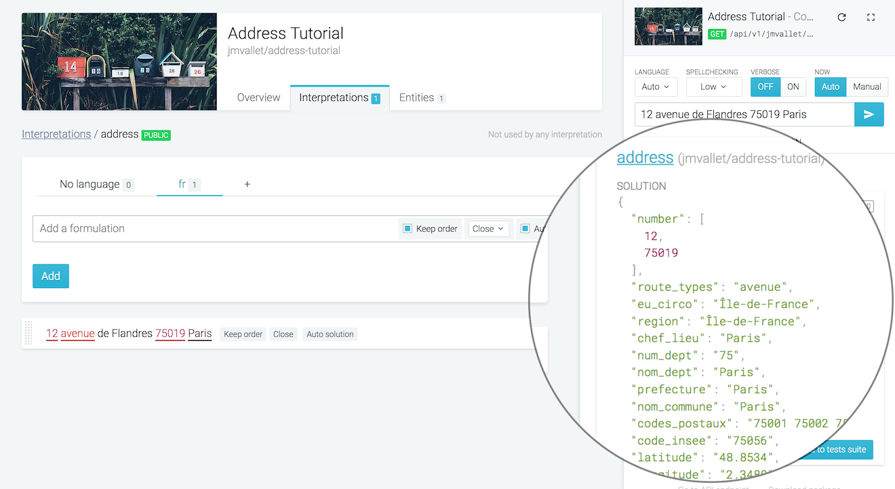
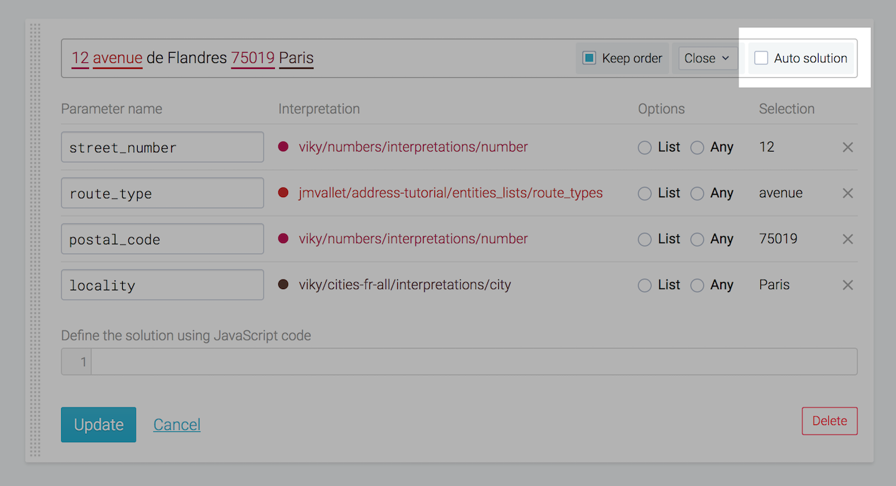
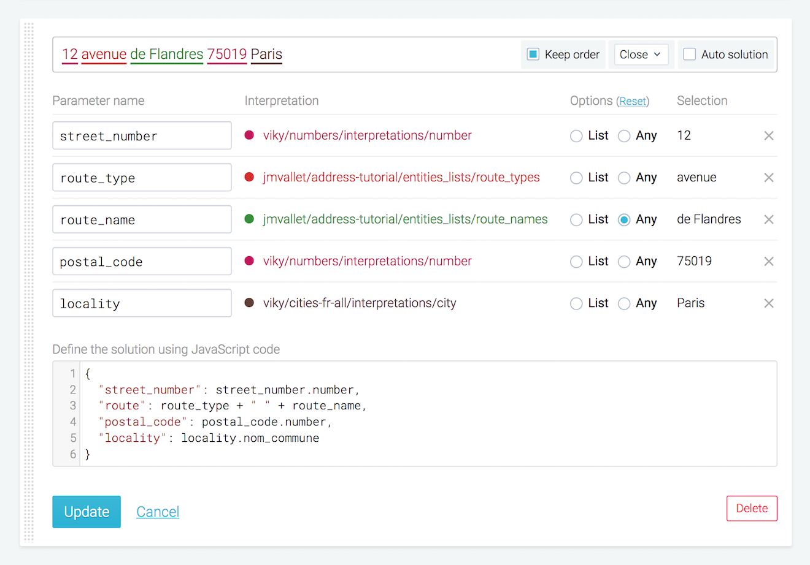
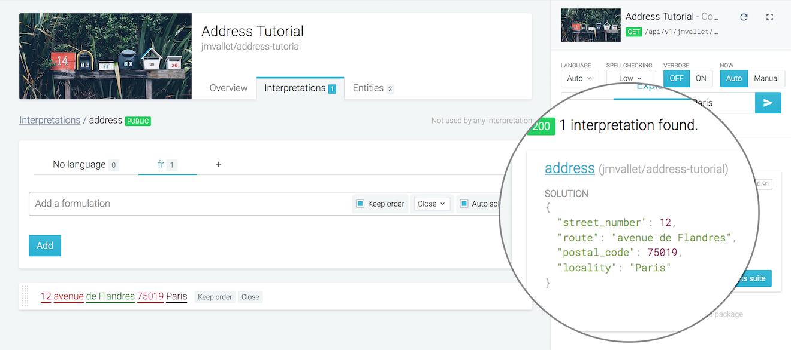

This tutorial begins where [Getting started - Part 2](../getting-started-part-2/) left off. You'll add some dependencies, use them to improve your "address" interpretation and use your agent through the API.

## Street number, postal code & locality

Let's continue with the detection of street number, postal code and locality.

### Let's add some dependencies

In order not to reinvent the wheel, you will add 2 agent dependencies as seen above:

- **Numbers** agent will allow you to understand ordinal and cardinal numbers written in digits or in letters. This seems appropriate to recognize street number and postal code.
- **Cities French All** agent will allow you to recognize French cities and give you their geographical coordinates. This seems appropriate to recognize locality.

To do this, return to the agent **Overview** tab.

<span class="tag tag--primary">Step 1</span> Click on **Add new dependency**.



<span class="tag tag--primary">Step 2</span> Search and choose the **Numbers** public agent.


<span class="tag tag--primary">Step 3</span> The **Numbers** agent is now in your dependencies.



<span class="tag tag--primary">Step 4</span> Let's add other dependency. Click on **Add new dependency**, search and choose the **Cities French All** public agent.



<span class="tag tag--primary">Done</span>  Now, both dependencies are in place.


### Edit address interpretation

In order to make the agent understand the street number, postal code and locality, go to the **Interpretations** tab. Then go to the **address** interpretation and edit the "12 avenue de Flandres 75019 Paris" formulation.

Let's start making highlights:

1. Highlight "**12**" and link it to the `viky/numbers/interpretations/number` interpretation.
2. Highlight "**75019**" and link it to the `viky/numbers/interpretations/number` interpretation.
3. Highlight "**Paris**" and link it to the `viky/cities-fr-all/interpretations/city` interpretation.

Don't highlight the route name for the moment, we will come back to it later.


If you try to update the formulation, an error will be displayed because the parameter name `number` is used twice.

In parameter name column:
1. Replace the first `number` value by `street_number`.
2. Replace `route_types` value by `route_type`.
3. Replace the second `number` value by `postal_code`.
4. Replace `city` by `locality`.


Click on **Update** in order to save these modifications.

### Validate in the console

Now test the sentence "12 avenue de Flandres 75019 Paris" in the console.



Every part is understood correctly, but the solution is quite verbose.

We will now customize the output in order to make it simpler to read.


### Improve solution output

Open the formulation and uncheck **Auto solution**. A textarea is now open at the bottom of the form.



This textarea allows you to customize the solution. The solution is a json map, and you can use all the variables listed in the **Parameter name** column.

Update the solution in order to have a solution like this:

```javascript
{
  "street_number": street_number,
  "route_type": route_type,
  "postal_code": postal_code,
  "locality": locality
}
```


The solution now becomes:


This is much more readable, but it is still not completely OK. Let's remove the extra **number** and only keep the locality name for the moment.

Replace the current solution with:

```javascript
{
  "street_number": street_number.number,
  "route_type": route_type,
  "postal_code": postal_code.number,
  "locality": locality.nom_commune
}
```

The solution is much better now:


## Route name

We will now try to understand the route names.

### Route names entities list

There are too many route names to import them all in viky.ai. Instead we will try to make the agent understand unknown route names.

First create a new private entities list **route_names**.

Fill it with some common route names such as **Champs Elysées**, **Rivoli**, etc...


### Edit address interpretation

Go back in the **Address** interpretation, edit the formulation, then:

1. Highlight **de Flandres**.
2. Create an alias to the entities list **route_names**.
3. Select **any** for this alias.
4. Replace parameter name `route_names` value by `route_name`.
5. Update solution with the code below.
6. Click on Update button.

```javascript
{
  "street_number": street_number.number,
  "route": route_type + " " + route_name,
  "postal_code": postal_code.number,
  "locality": locality.name,
}
```



In the console, test the sentence "12 avenue de Flandres 75019 Paris" now. Every part is understood correctly, even the route name.



Try a completely different address, for example "108 rue Jean Moulin 54230 Neuves-Maisons". It works too!


Congratulations! You now have your very own agent in viky.ai that can recognize simple French postal addresses.

viky.ai does not limit you to use your agents within the platform. In the following section,
we will show you how you can access your agent through an external application.

## Connect with your agent

In this last step you will use your agent's abilities from your own application.
Every agent in viky.ai is reachable through a [public REST API](../../api/agents). To access the API, you will first need the agent's API token. You can find it in the configuration panel in the agent's overview screen.


The API token is a 32 characters unique identifier that the developers must provide to prove that they are allowed to consume this agent.


Then, any HTTP client library will be able to send a sentence to the agent and get back the corresponding solution.
A quick connection check can be made with a simple `curl` call:

```bash
$ curl -G "https://viky-beta.viky.ai/api/v1/agents/<your_username>/address-tutorial/interpret.json?" \
       -H "Agent-Token: <agent_token>" \
       --data-urlencode "sentence=12 avenue de Flandres 75019 Paris"
```

The HTTP response is the expected JSON:
```json
{
  "interpretations": [
    {
      "id": "<interpretation_id>",
      "slug": "<your_username>/address-tutorial/interpretations/address",
      "name": "address",
      "score": 0.91,
      "solution": {
        "street_number": 12,
        "route": "avenue de Flandres",
        "postal_code": 75019,
        "locality": "PARIS"
      }
    }
  ]
}
```
