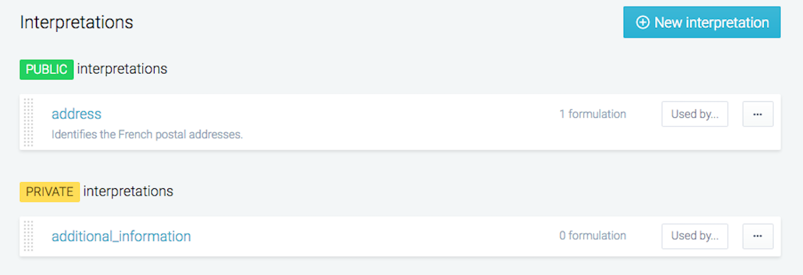
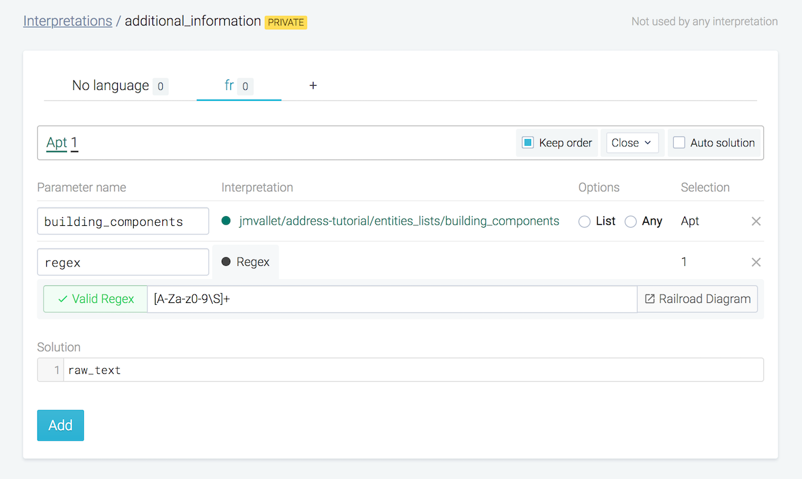
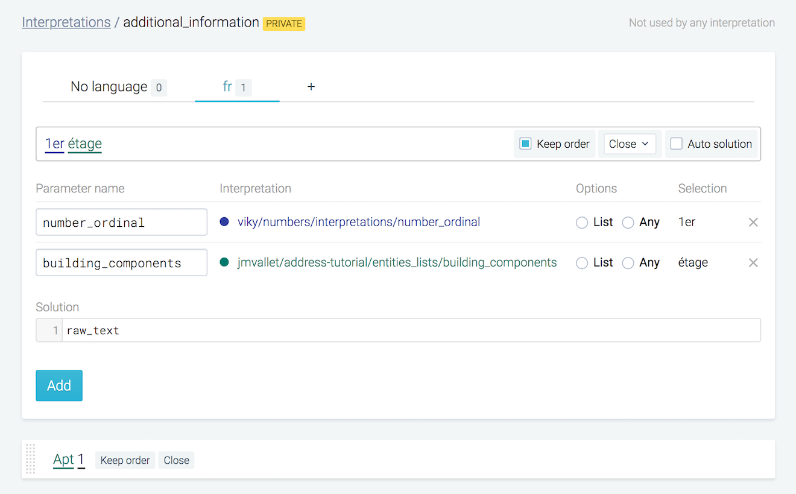
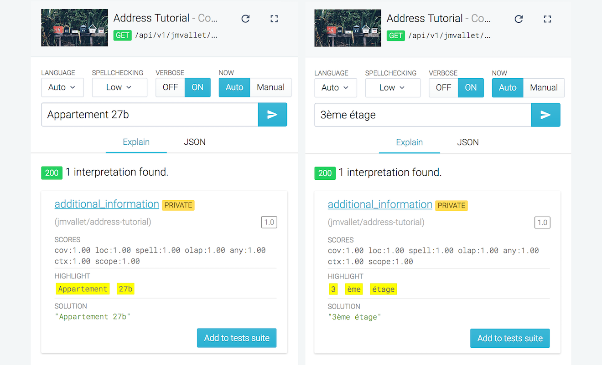
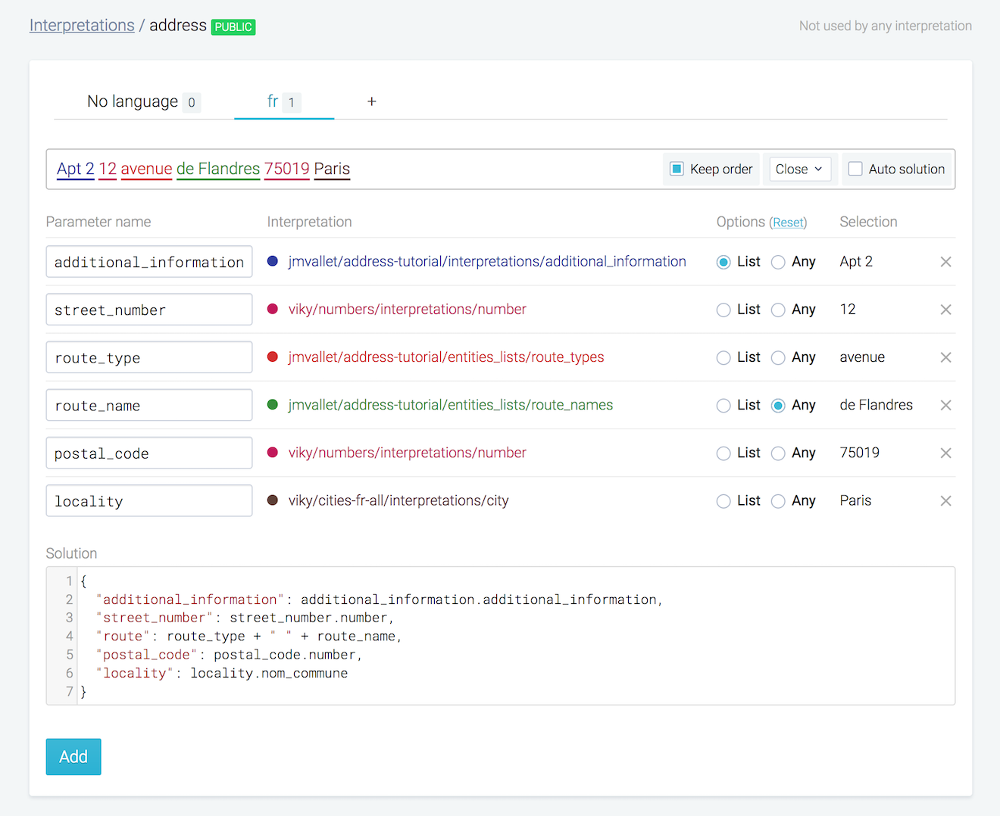

This tutorial begins where [Getting started - Part 3](../getting-started-part-3/) left off. You'll add another interpretation in order to improve your agent.

## Additional address information

An address can contain additional information such as the apartment number, building number, floor number and so on. These are all optional information in an address.

Addresses with additional info can take the form of any one of the following:

* Apt 2, 12 avenue de Flandres 75019 Paris
* Apt 2, Batiment B, 12 avenue de Flandres 75019 Paris
* Apt 2, 1er étage, Batiment B, 12 avenue de Flandres 75019 Paris

Let us see how we can incorporate this in our agent.

One way would be to create separate formulations for each of these sentences. However, the better and non repetitive way is to treat these additional information in the address as a list. Let us see how we can do this.

## Recognize additional info individually

Let us first create a few components that will recognize the additional information in the address.

<span class="tag tag--primary">Step 1</span> <strong>Create a private entities list "building_components"</strong>

Then add the following entities with enabled auto solution option.

```
batiment
bat
```
```
étage
```
```
appartement
apt
```


<span class="tag tag--primary">Step 2</span> <strong>Create a private interpretation "additional_information"</strong>



<span class="tag tag--primary">Step 3</span> <strong>Add first formulation in the interpretation</strong>

1. Type "Apt 1" in the input field.
2. Highlight "Apt" and link to the "building_components" entities list you created earlier.
3. Highlight "1" and link to "Regex" type. Type `[A-Za-z0-9\S]+` in the Regex input field.
4. Set solution to `raw_text`.



<span class="tag tag--primary">Step 4</span> <strong>Add second formulation in the interpretation</strong>

1. Type "1er étage" in the input field.
2. Highlight "1er" and link to the `viky/numbers/interpretations/number_ordinal` interpretation.
3. Highlight "étage" and and link to the `building_components` entities list.
4. Set solution to `raw_text`.



<span class="tag tag--primary">Step 5</span> <strong>Validate your work</strong>

You now have an interpretation that can detect expressions such as "3ème étage" or "Appartement 27b".

Use the console to check this. The interpretation "additional_information" being private, use the verbose option in the console which allows you not to exclude private interpretations.




## Integrate recognition of additional info

Now that we have a private interpretation to recognize additional information, let us create a new formulation in our public "Address" interpretation.

1. Type "Apt 2 12 avenue de Flandres 75019 Paris"
2. Highlight "Apt 2" and link it to "additional_information" interpretation.
3. Select the option "List".
4. Highlight other part like the existing interpretation.
5. Add the following solution.

```javascript
{
  "additional_information": additional_information.additional_information,
  "street_number": street_number.number,
  "route": route_type + " " + route_name,
  "postal_code": postal_code.number,
  "locality": locality.nom_commune
}
```



You can now validate your work by checking the agent's behavior using the console. :tada:


